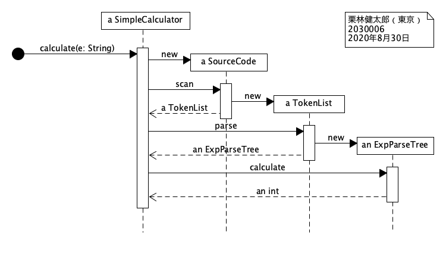
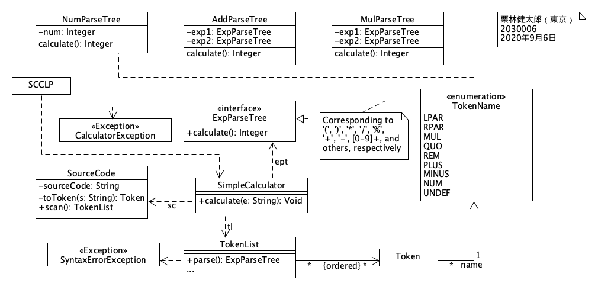
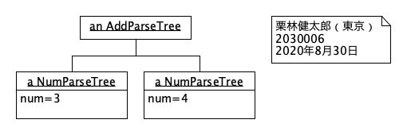
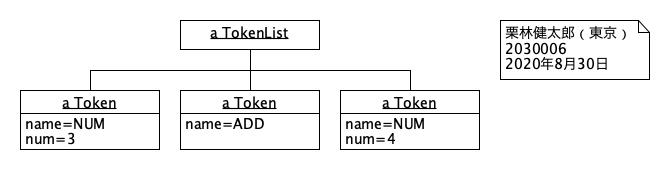

# Exercise 1

* 氏名: 栗林健太郎
* 学生番号: 2030006
* 作成日: 2020年9月6日

## シーケンス図

上記に示したシーケンス図は、ここで開発するプログラム`SCCLP`を構成するオブジェクト間のやり取りを、時間軸に沿って説明するものである。以下のやりとりが示されている。

1. `SimpleCalculator`クラスのオブジェクト`a SimpleCalculator`は、`String`型の引数`e`とともに`calculate`メッセージを受け取る
2. `a SimpleCalculator`は、`SourceCode`クラスのオブジェクト`a SourceCode`を生成する
3. `a SourceCode`は`TokenList`クラスのオブジェクト`a TokenList`を生成し、`a SimpleCalculator`へ返す
4. `a SimpleCalculator`は`a TokenList`に対して`parse`メッセージを投げる。
5. `a TokenList`は、`ExpParseTree`クラスのオブジェクト`an ExpParseTree`を生成し、`a SimpleCalculator`へ返す
6. `A SimpleCalculator`は`an ExpParseTree`に対して`calculate`メッセージを投げると、`an ExpParseTree`は計算結果を`int`型の結果として返す

## クラス図

上記に示したクラス図は、ここで開発するプログラム`SCCLP`を構成するクラスとそれらの関係を説明するものである。以下に、上図の概要を説明する。

* `SCCLP`が、ここで開発するプログラムを表している。このプログラムは`SimpleCalculator`クラスに依存している
* `SimpleCalculator`クラスは:
  * パブリックメソッド`calculate(e: String): Void`を持つ
  * 以下の3つのクラスに依存している
    1. `SourceCode`クラス
    2. `TokenList`クラス
    3. `ExpParseTree`インタフェイスを実装したクラス
* `SourceCode`クラスは:
  * プライベートフィールド`souceCode`
  * プライベートメソッド`toToken(s: String)`、および、パブリックメソッド`scan(): TokenList`を持つ
* `TokenList`クラスは:
  * パブリックメソッド`parse(): ExpParseTree`を持つ
    * このメソッドの返り値は、順序付けされた複数の`Token`に関連付けられている
      * `Token`はそれぞれ、noteに記載の文字に対応する`TokenName`のいずれかひとつに関連付けられている
  * `SyntaxErrorException`クラスに依存する。すなわち、シンタックスエラー時に例外を発生させる
* `ExpParseTree`インタフェイスを実装するクラス（具体的には、`NumParseTree`、`AddParseTree`、`MulParseTree`）は、
  * プライベートフィールド`exp1`、`exp2`を持つ
  * パブリックメソッド`calculate(): Integer`を持つ
* `CalculateException`クラスに依存する。すなわち、計算実行のエラー時に例外を発生させる

## オブジェクト図

### ひとつめ

上記に示したオブジェクト図は、上記のクラス図にある`AddParseTree`クラスのオブジェクトに関する関連を説明するものである。以下に、上図の概要を説明する。

* `an AddParseTree`はプライベートフィールド`exp1`および`exp2`を通じて、2つのオブジェクトと関連づけられている
  * `exp1`: プライベートフィールド`num`の値が`3`である`a NumParseTree`オブジェクト
  * `exp2`: プライベートフィールド`num`の値が`4`である`a NumParseTree`オブジェクト

### ふたつめ

上記に示したオブジェクト図は、上記のクラス図にある`TokenList`クラスのオブジェクトに関する関連を説明するものである。以下に、上図の概要を説明する。

* この図における`a TokenList`は、以下の3つの`Token`と関連付けられている
  * `TokenName`の`NUM`と関連付けれられており、`num`が3の`Token`
  * `TokenName`の`ADD`と関連付けれられている`Token`
  * `TokenName`の`NUM`と関連付けれられており、`num`が4の`Token`
