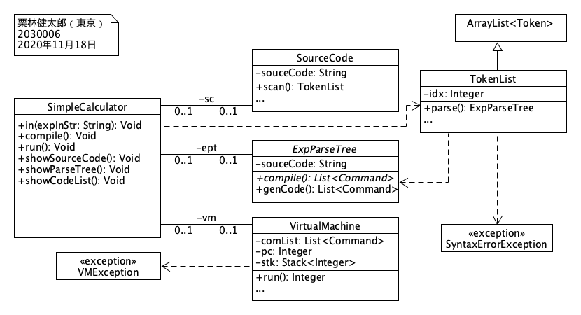
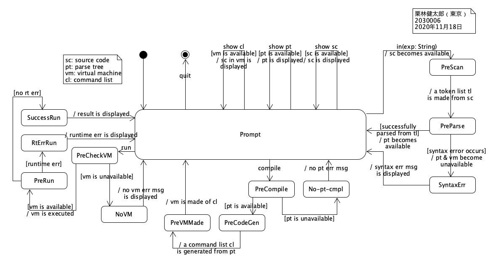
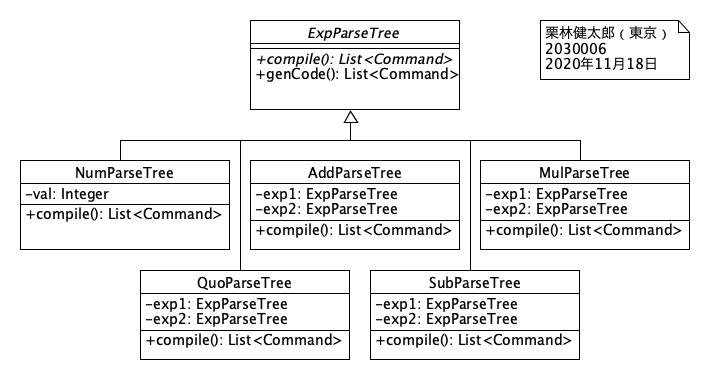
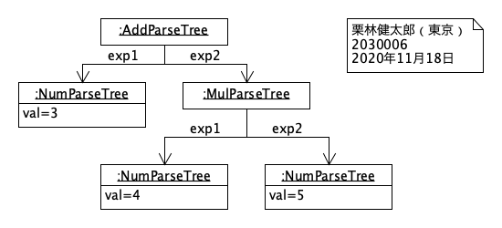
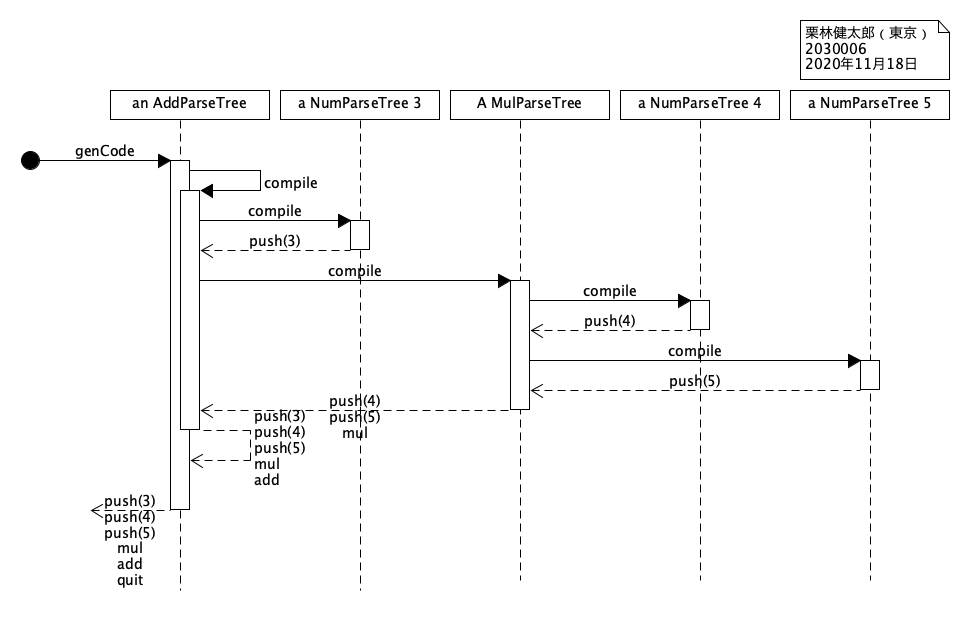
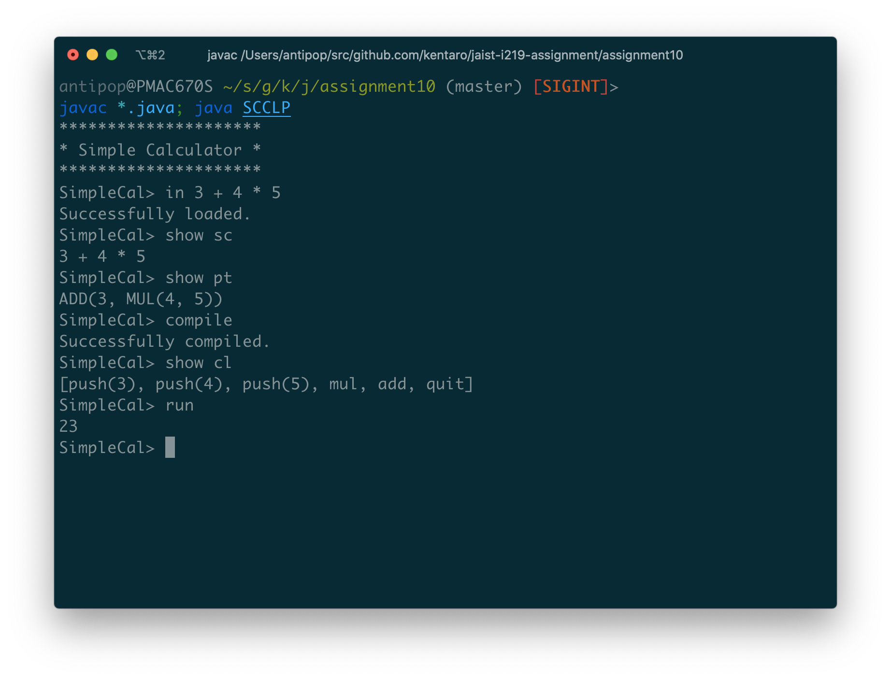
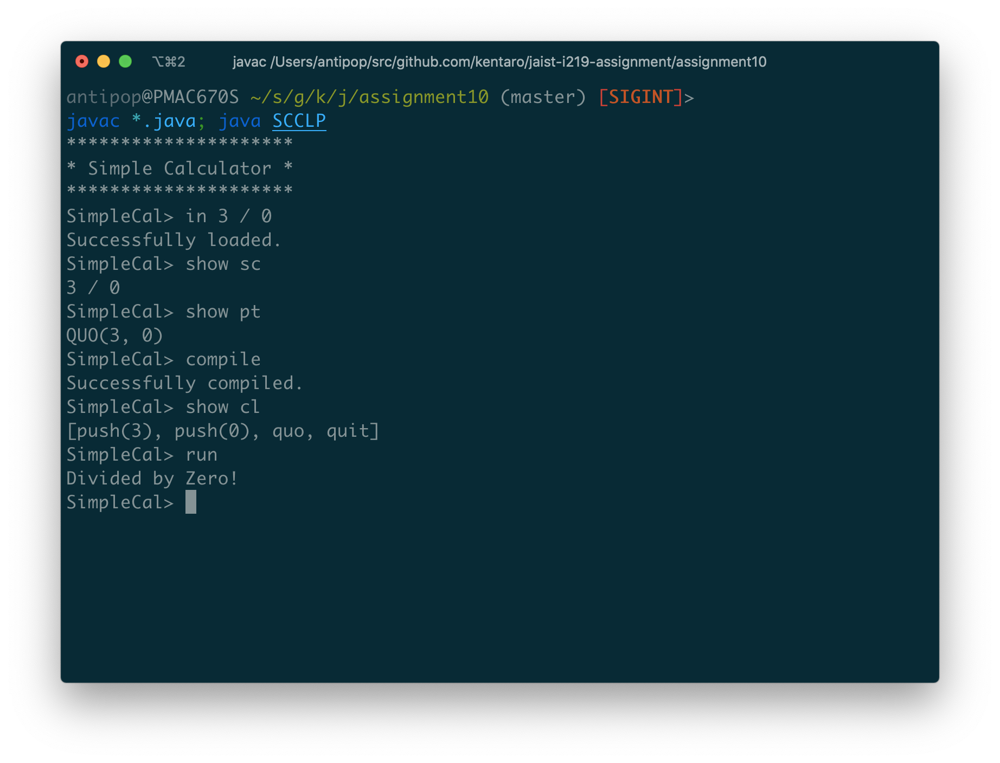

# Assignment 10

* 氏名: 栗林健太郎
* 学生番号: 2030006
* 作成日: 2020年11月20日

## Simple Calculator

本課題では、これまでに実装したSimple Calculatorを、仮想機械を用いる方式に変更する。以下では、クラス図、状態図に基づいて、プログラムについて説明する。

### クラス図

#### `SimpleCalculator`

計算機を表すクラスである。

`in(expInStr: String)`により、プロンプトからユーザ入力を計算式として受け取る。`compile()`により、計算式のトークンを仮想機械の命令列に変換する。`run()`により、仮想機械で命令列を実行する。

その他、`showSourceCode`、`showParseTree()`、`showCodeList()`として、計算機の内部状態を表示するメソッドを用意している。

#### `SourceCode`

入力された計算式を解析し、トークンのリストに変換するクラスである。

#### `TokenList`, `SyntaxErrorException`

ソースコードからパースされたトークンのリストを表すクラスである。また、シンタックスエラー時には`SyntaxErrorException`例外が投げられる。

#### `ExpParseTree`

構文木を表すクラスの親となる`ExpParseTree`抽象クラスを提供する。`genCode()`メソッドにより、構文木から仮想機械の命令列を生成する。

#### `VirtualMachine`

仮想機械を表すクラスである。

`run`メソッドにより、コンストラクタに渡された命令列を順次実行していく。`PUSH`命令によりスタックに置かれた値を各命令に応じて取り出して計算した後、計算結果をスタックに書き戻す。最終的に、`QUIT`命令が実行され、スタックのトップにある値が仮想機械の計算結果として返却される。

`pc`アトリビュートは、実行する命令の場所を示している。また、本仮想機械はスタックマシンとして実装されているため、`stk`は計算結果を保持するスタックを表している。

実行時エラー時には`VMException`例外が投げられる。

### 状態図

この状態図は、計算機プログラムの内部状態をユースケースに沿って示すものである。

`show sc`は、入力された計算式を表示する。`show pt`は、計算式をパースして得られた構文木を表示する。`show cl`は、構文木からコンパイルして生成された仮想機械の命令列を表示する。

`in(exp: String`は、入力された計算式をパースしてトークンのリストに変換し、そのリストから構文木を構築する処理を示している。構文木の構築が成功したら、`show pt`コマンドが利用できるようになる。シンタックスエラーがあったら、`SynatxErrorException`例外が投げられる。

`comple`は、構文木から仮想機械の命令列を生成する。既に構文木が構築されていたら、仮想機械の命令列を生成し、`show cl`コマンドが利用できるようになる。そうでない場合は構文木が構築されていない旨のエラーメッセージを表示する。

`run`は、仮想機械の命令列を実行する。命令列の実行が成功したら、計算結果が表示される。そうでなかったら、`VMException`例外が投げられる。

## `ExpParseTree`, `NumParseTree`, `AddParseTree`, `MulParseTree`, `QuoParseTree`, `SubParseTree`

### クラス図

`ExpParseTree`抽象クラスを継承し、具体的な構文木を表すクラス群である。それぞれが仮想機械の命令（`PUSH`, `ADD`, `MUL`, `QUO`, `SUB`）に対応する。

### オブジェクト図

計算式として`3 + 4 * 5`を入力した際の構文木を示すオブジェクト図である。

### シーケンス図

計算式として`3 + 4 * 5`を入力し、`genCode()`メソッドが呼ばれた際の処理の流れを示すシーケンス図である。

構文木を表すオブジェクトが再帰的に呼び出され、仮想機械の命令列が生成されていく様子を示している。

## 実行結果

`SCCLP.java`を実行することで以下の通り動作を確認した。

### 正常例

上記の通り、`3 + 4 * 5`の計算が成功することを確認した。

### 失敗例

上記の通り、0で除した計算が`VMException`例外を引き起こし`Divided by Zero!`としてエラーになることを確認した。
