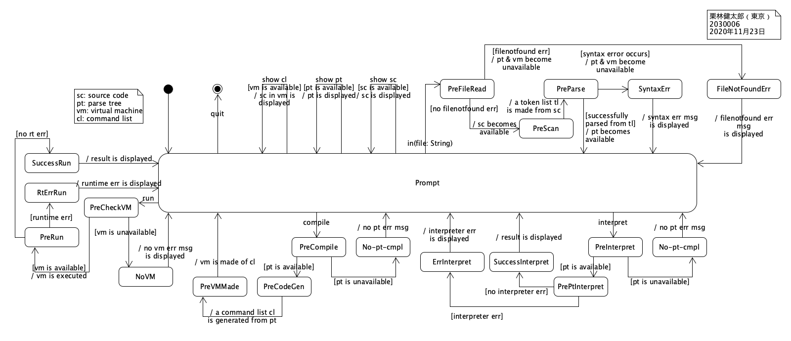
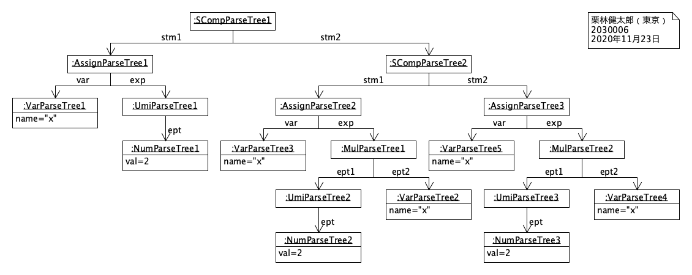
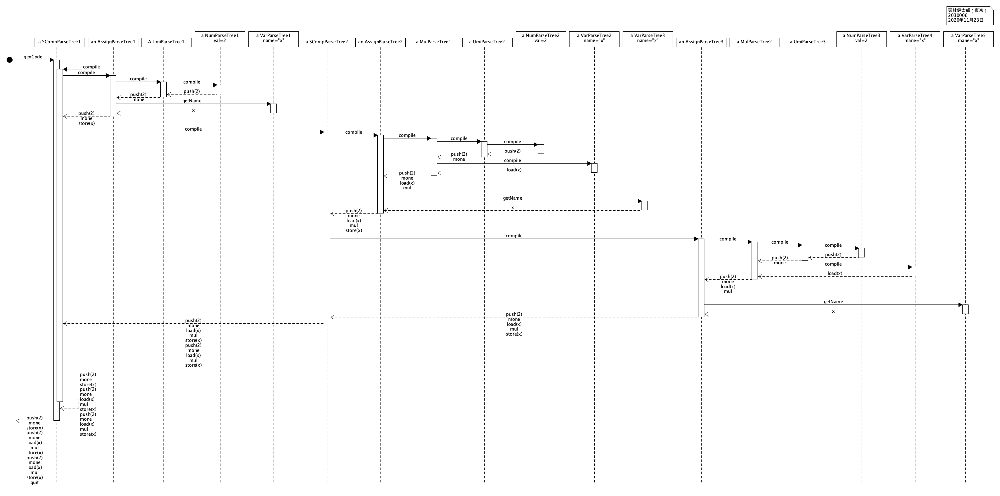
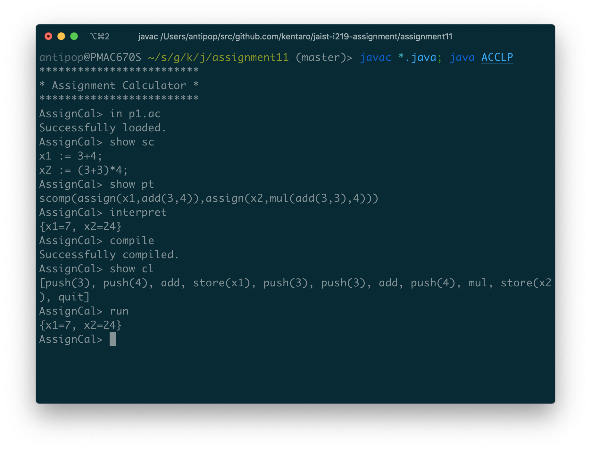
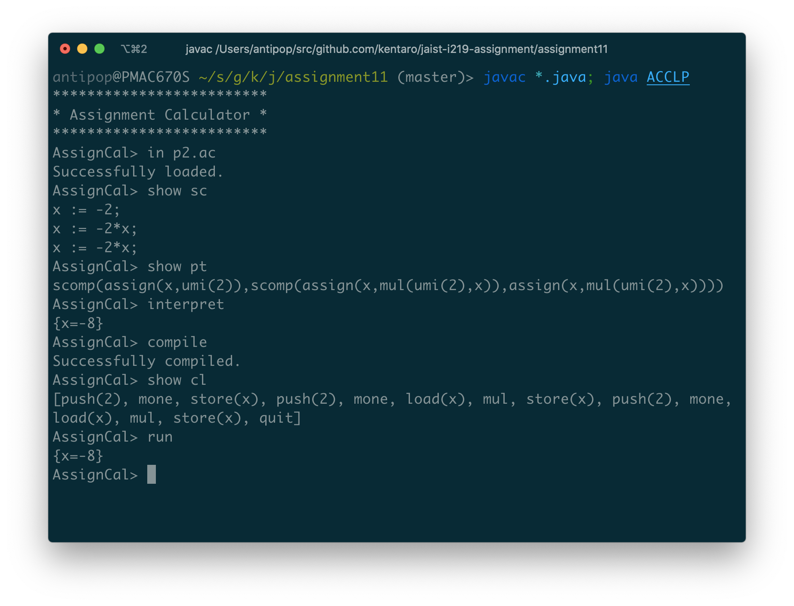
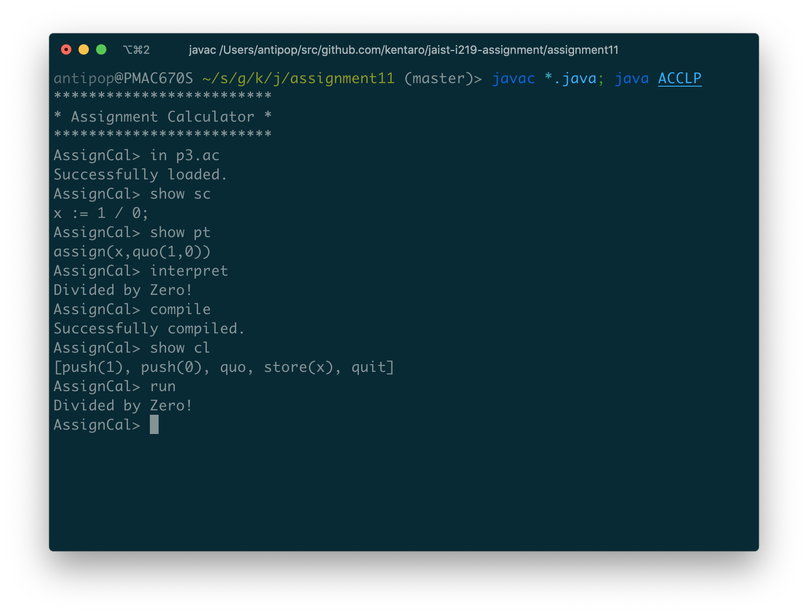
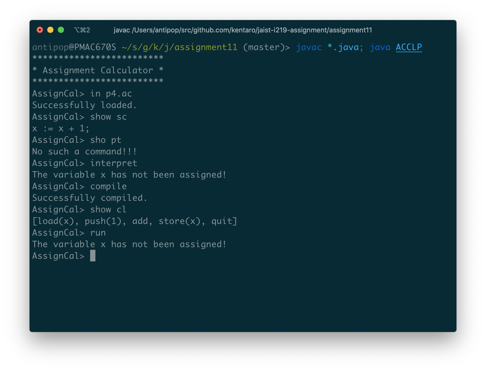

# Assignment 11

* 氏名: 栗林健太郎
* 学生番号: 2030006
* 作成日: 2020年11月23日

## Assignment Calculator

本課題では、Simple Calculatorに変数と代入文を追加したAssignment Calculatorを実装した。

### 状態図



この状態図は、計算機プログラムの内部状態をユースケースに沿って示すものである。以下、Simple Calculatorから変更があった箇所についてのみ説明する。

`in(file: String)`は、入力されたファイル名によって指定されるファイルの内容を読み込み、プログラムをパースしてトークンのリストに変換し、そのリストから構文木を構築する処理を示している。指定されたファイルが見つからなかったら、`FileNotFoundException`例外が投げられる。

`interpret`は、構文木を再帰的に評価していき、計算結果を表示する。ゼロ除算や未定義の変数への参照時には、`InterpreterException`例外が投げられる。

### `VirtualMachine`

計算機プログラムの仮想機械を表すクラスである。以下、Simple Calculatorから変更があった箇所についてのみ説明する。

変数の代入と参照に対応するため、`LOAD`、`STORE`、および負の単項演算を表す`MONE`命令が追加されている。また、変数を格納するために、`private Map<String, Integer> env`属性が追加されている。

`LOAD`命令では、指定された変数名に対応する値を、`env`から取得しスタックに載せる。`STORE`命令では、スタックの先頭にある値を指定された変数名の値として`env`を更新する。

仮想機械は、`run`メソッドで命令列の実行が終わると、`env`を返す。

## 構文木のクラス

前回までの`ExpParseTree`, `NumParseTree`, `AddParseTree`, `MulParseTree`, `QuoParseTree`, `SubParseTree`に加えて、以下が新たに追加されている。

* `SCompParseTree`
* `AssignParseTree`
* `VarParseTree`
* `RemParseTree`

`SCompParseTree`は、逐次結合文を表すクラスである。`AssignParseTree`は、代入文を表すクラスである。`VarParseTree`は、変数を表すクラスである。`RemParseTree`は、剰余演算を表すクラスである。

### オブジェクト図



プログラムとして、以下を入力した際の構文木を示すオブジェクト図である。

```
x := -2;
x := -2*x;
x := -2*x;
```

### シーケンス図



プログラムとして、以下を入力し、`genCode()`メソッドが呼ばれた際の処理の流れを示すシーケンス図である。

```
x := -2;
x := -2*x;
x := -2*x;
```

構文木を表すオブジェクトが再帰的に呼び出され、仮想機械の命令列が生成されていく様子を示している。

## 実行結果

`ACCLP.java`を実行することで以下の通り動作を確認した。

### 正常例



上記の通り、p1.acに含まれる以下のプログラムの実行が成功することを確認した。

```
x1 := 3+4;
x2 := (3+3)*4;
```



上記の通り、p2.acに含まれる以下のプログラムの実行が成功することを確認した。

```
x := -2;
x := -2*x;
x := -2*x;
```

### 失敗例



上記の通り、0で除した計算が`Divided by Zero!`としてエラーになることを確認した。



上記の通り、未定義の変数への参照が`The variable x has not been assigned!`としてエラーになることを確認した。
