# Assignment 12

* 氏名: 栗林健太郎
* 学生番号: 2030006
* 作成日: 2020年11月23日

## `PrintingThread`

3つのスレッドを立ち上げ、それぞれのスレッド内で50回プリント処理を行っている。スレッドは並行処理されるため、以下の実行結果の通り、プリント結果が入り混じって表示される。

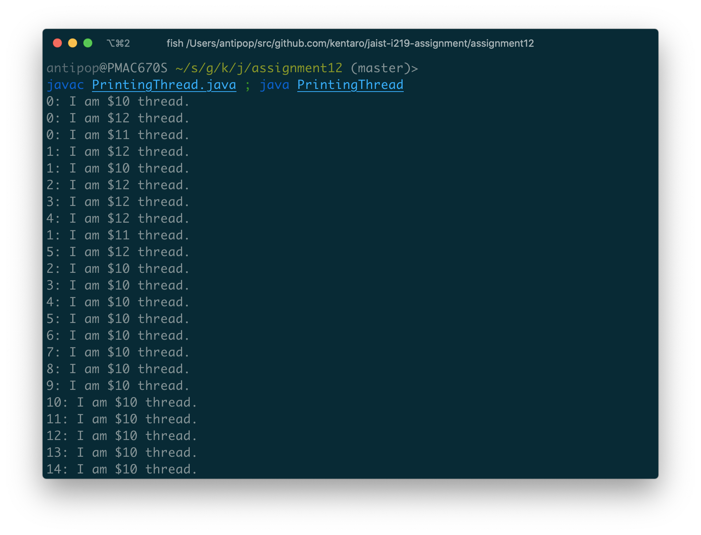

## `UnsafeInc`, `NonatomicCounter`

3つのスレッドを立ち上げ、それぞれのスレッド内で100万回、`NonatomicCounter`クラスで実装されたカウンターをインクリメントする処理を行っている。

各スレッドからのカウンターへの更新処理を同期していないため、以下の実行結果の通り、実行するたびに結果が異なっている（レースコンディションが存在する）。

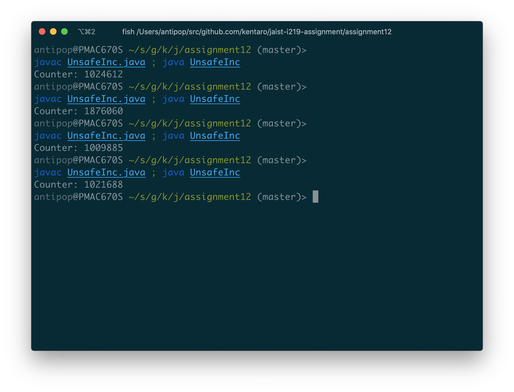

## `SafeInc`, `AtomicCounter`

3つのスレッドを立ち上げ、それぞれのスレッド内で100万回、`AtomicCounter`クラスで実装されたカウンターをインクリメントする処理を行っている。

各スレッドからのカウンターへの更新処理を同期しているため、以下の実行結果の通り、何度実行しても同じ結果が表示される（レースコンディションが存在しない）。

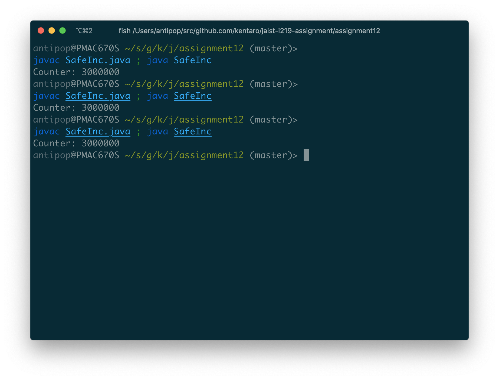

## `SafeInc2`, `NonatomicCounter`

3つのスレッドを立ち上げ、それぞれのスレッド内で100万回、`NonatomicCounter`クラスで実装されたカウンターをインクリメントする処理を行っている。

各スレッドからは、`NonatomicCounter`クラスのオブジェクトへのロックを獲得しているため、`counter.inc()`への呼び出しが同期され、以下の実行結果の通り、何度実行しても同じ結果が表示される（レースコンディションが存在しない）。

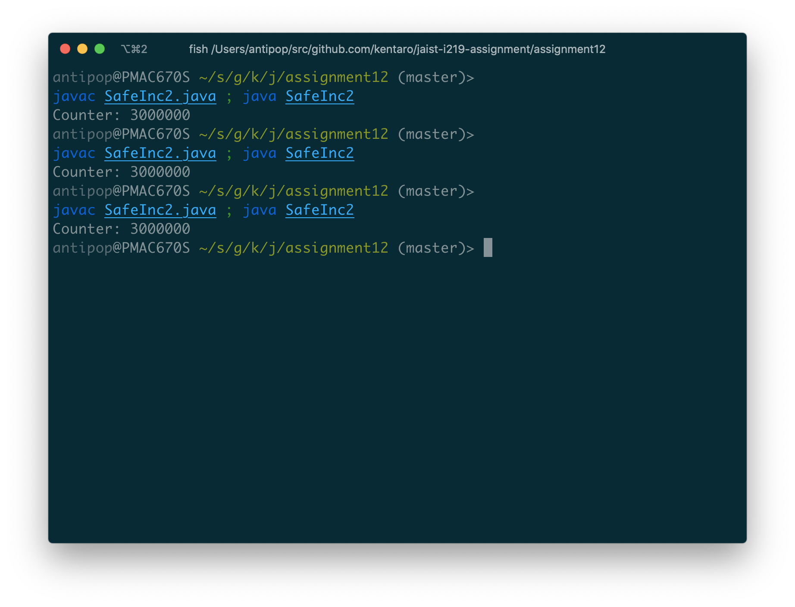

## `PseudoSafeInc`, `PseudoAtomicCounter`

3つのスレッドを立ち上げ、それぞれのスレッド内で100万回、`PseudoAtomicCounter`クラスで実装されたカウンターをインクリメントする処理を行っている。また、その際、各スレッドからはそれぞれインスタンス化した`PseudoAtomicCounter`オブジェクトを参照している。

`PseudotomicCounter`クラスのメソッドは`synchronized`でメソッドレベルの同期が宣言されているため一見問題ないように見えるが、`count`属性はスタティック変数として宣言されているためそれへの操作が同期されず、以下の実行結果の通り、以下の実行結果の通り、実行するたびに結果が異なっている（レースコンディションが存在する）。

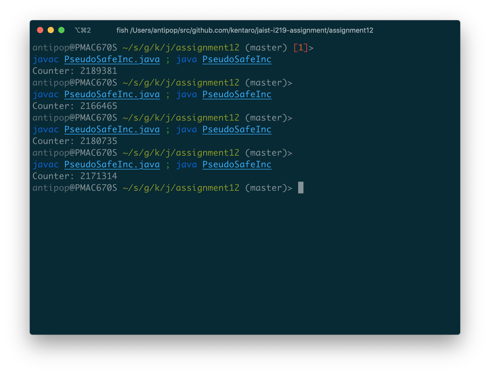

## `PseudoSafeInc2`, `NonatmicCounter`

3つのスレッドを立ち上げ、それぞれのスレッド内で100万回、`NonatomicCounter`クラスで実装されたカウンターをインクリメントする処理を行っている。

`PseudoSafeInc2`クラスの`run`メソッドはカウントアップ処理する直前で`synchronized`で自らに対してロックを取っているため一見問題ないように見えるが、`NonatmicCounter`の`inc()`メソッドの処理に対しては操作が同期されておらず、以下の実行結果の通り、以下の実行結果の通り、実行するたびに結果が異なっている（レースコンディションが存在する）。

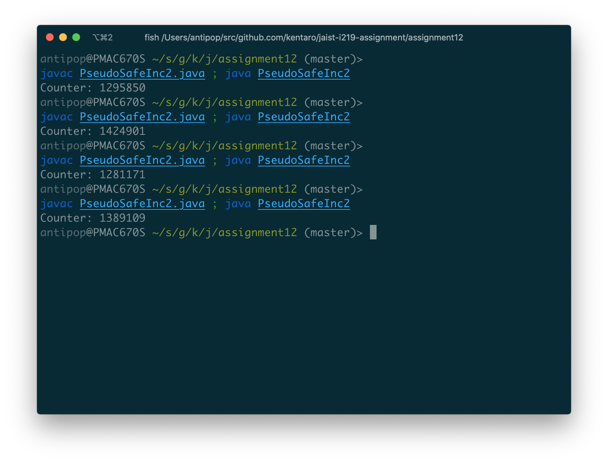

## `DeadlockInc`, `NonatmicCounter`

2つのスレッドを立ち上げ、それぞれのスレッド内で5,000回、`NonatomicCounter`クラスで実装されたカウンターをインクリメントする処理を行おうとしている。

`DeadlockInc`クラスの`run`メソッドはカウントアップ処理する直前で、`counter1`と`counter2`とをその順番で同期する処理を行っている。そのため、2つのスレッドがカウンターの順番を逆に参照してしまうとそれぞれのスレッドが他方のスレッドのロックが開放されるのを待ち続けてしまうため、以下の実行結果の通り、プログラムが終了しない（デッドロックが発生する）。

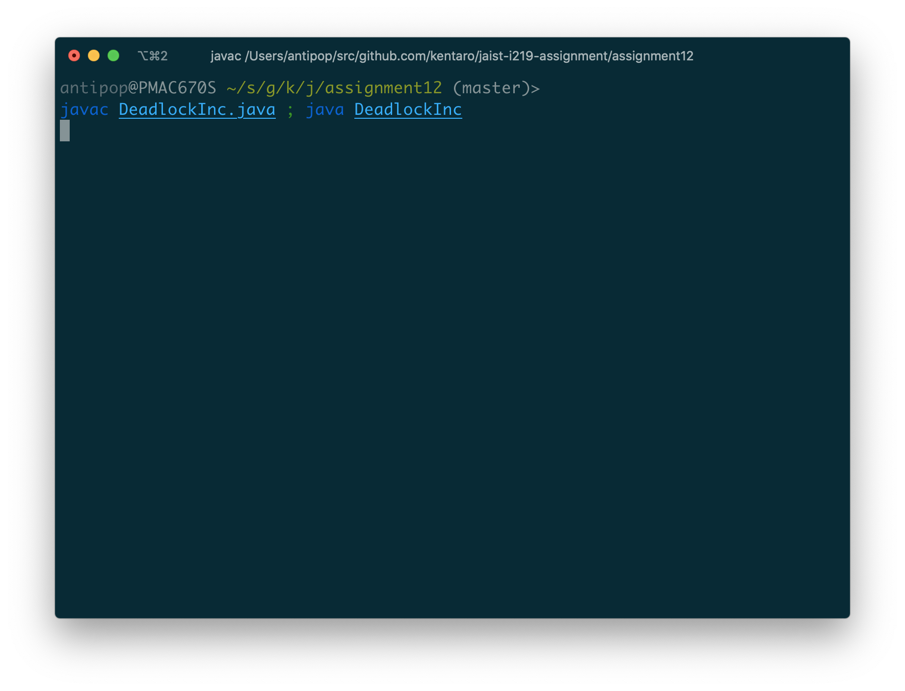

## `NoDeadlockInc`, `NonatmicCounter`

2つのスレッドを立ち上げ、それぞれのスレッド内で5,000回、`NonatomicCounter`クラスで実装されたカウンターをインクリメントする処理を行おうとしている。

`DeadlockInc`、と違って`counter1`と`counter2`とを同じオブジェクトにひもづく順番で参照しているため、以下の実行結果の通り、プログラムが終了する（デッドロックが発生しない）。

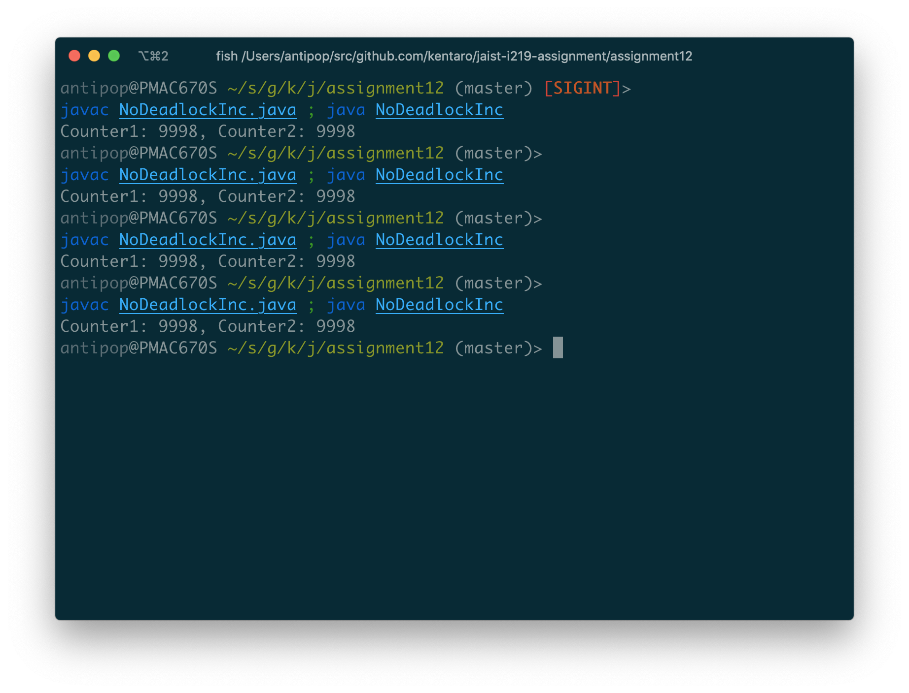

## Bounded Buffer Problem

Bounded Buffer Problemの実装について検討する

### `FBBProb1`

まず、バッファへの操作がなにも同期されない実装で動作させてみると、レースコンディションが存在するため、以下の実行結果の通り、Senderが送信したメッセージとReceiverが受け取るメッセージとは一致しない。

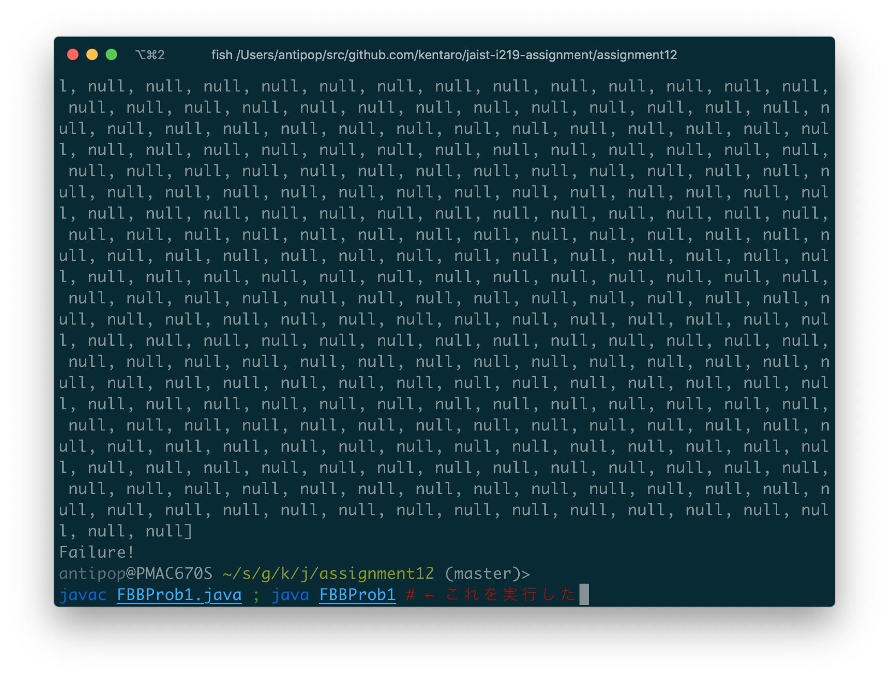

### `FBBProb2`

次に、バッファへの`put`および`get`メソッドを`synchronized`で同期する実装で動作させてみる。

しかし、`put`では`capaciry`で設定されている数のメッセージは捨てられてしまい、かつ、`get`ではキューにメッセージが入っていないと`null`を返すため、以下の実行結果の通り、Senderが送信したメッセージとReceiverが受け取るメッセージとは一致しない。

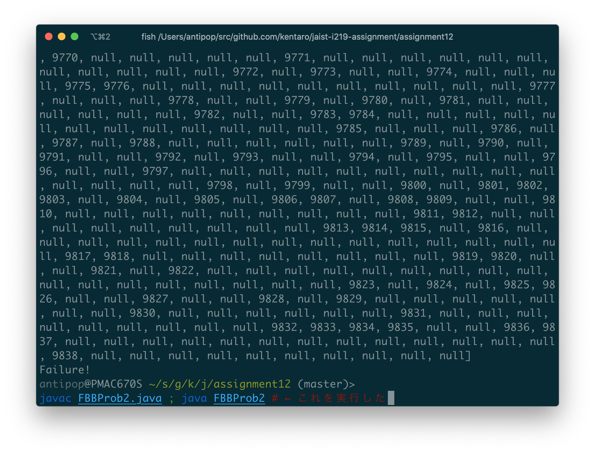

### `FBBProb3`

そこで、バッファへの`put`時にキューにメッセージが入れられるようになるまで待ち、かつ、`get`時にキューから`null`でないメッセージが取得できるようになるまで待つ実装で動作させてみる。

今度は、上記で待つ実装をした箇所でロックを持ったままループに入るために2つのスレッドの間でデッドロックが発生し、以下の実行結果の通り、プログラムが終了しない。

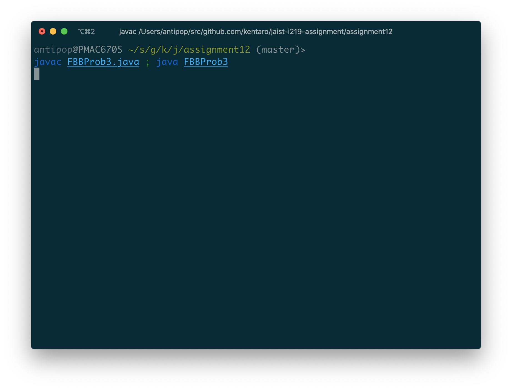

### `BBProb`

最後に、前述で待つ処理を実装するループ内で`wait()`を実行し、キューへの操作・参照が終わったら`notifyAll()`を実行する実装に変更してどうさせてみる。

今度は、`wait()`でロックを開放したあとに他のスレッドが`notifyAll()`を実行するまで待つという動作になるため、`put`はキューにメッセージを取りこぼしなく入れることができ、また`get`はキューからすべてのメッセージを取得することができ、以下の実行結果の通り、Senderが送信したメッセージとReceiverが受け取るメッセージとが一致する。

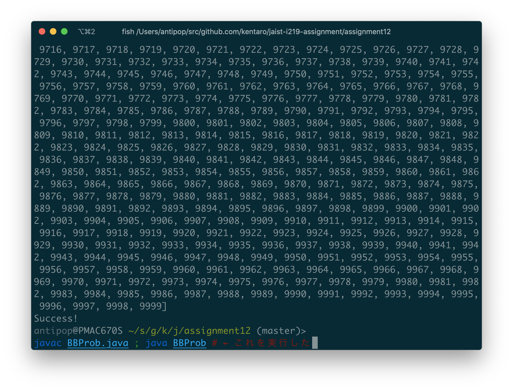
