# Assignment 13

* 氏名: 栗林健太郎
* 学生番号: 2030006
* 作成日: 2020年11月30日

## `SimpInc`

まずは競合の起こらない`SimpInc.java`を実行する。

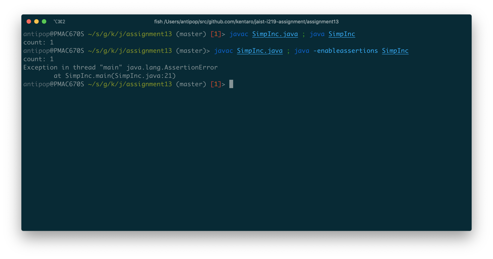

上記の通り、`count: 1`が表示される（2度めの実行のように`-enableassertions`オプションをつけて実行するとアサーションエラーが起こる）。

`SimpInc`をJPFで検査する。

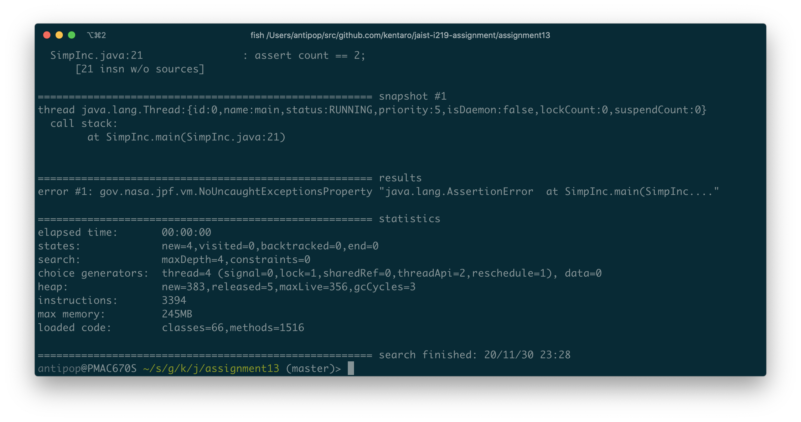

以下の通り、アサーションエラーで終了する。

```
====================================================== snapshot #1
thread java.lang.Thread:{id:0,name:main,status:RUNNING,priority:5,isDaemon:false,lockCount:0,suspendCount:0}
  call stack:
	at SimpInc.main(SimpInc.java:21)


====================================================== results
error #1: gov.nasa.jpf.vm.NoUncaughtExceptionsProperty "java.lang.AssertionError  at SimpInc.main(SimpInc...."
```

スレッドの実行の様子は以下の通りである（競合に関係する箇所のみ抜粋）。

```
====================================================== trace #1
------------------------------------------------------ transition #1 thread: 0
gov.nasa.jpf.vm.choice.ThreadChoiceFromSet {id:"START" ,1/2,isCascaded:false}
      [2 insn w/o sources]
  SimpInc.java:12                : count++;
  SimpInc.java:13                : t.join();
      [1 insn w/o sources]
------------------------------------------------------ transition #2 thread: 1
gov.nasa.jpf.vm.choice.ThreadChoiceFromSet {id:"JOIN" ,1/1,isCascaded:false}
      [1 insn w/o sources]
  SimpInc.java:1                 : public class SimpInc extends Thread {
  SimpInc.java:6                 : count2++;
  SimpInc.java:7                 : }
  SimpInc.java:4                 :
```

`count`変数に対する操作は`thread: 0`のみで行われている。そのため、`thread: 0`（メインスレッド）と`thread: 1`の間で`count`変数にたいする競合は起こっていない。

## `SimpConcInc`

競合の起こる`SimpConcInc.java`を実行する。

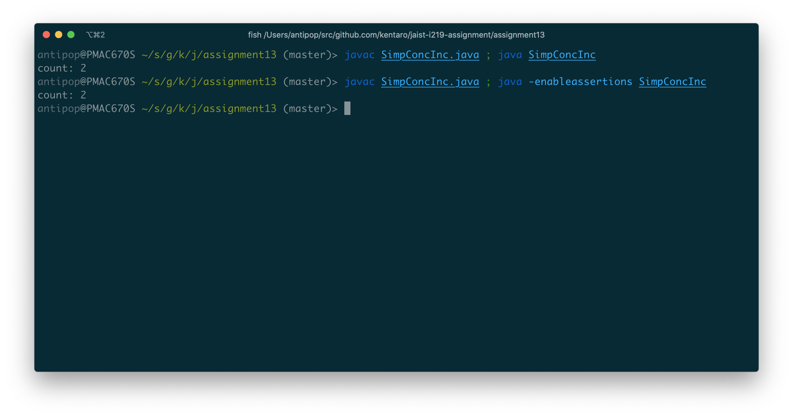

上記の通り、`count: 2`が表示される。`-enableassertions`オプションをつけて実行してもエラーが起こらないため、一見すると正しく実行されているかのように見える。

`SimpConcInc`をJPFで検査する。

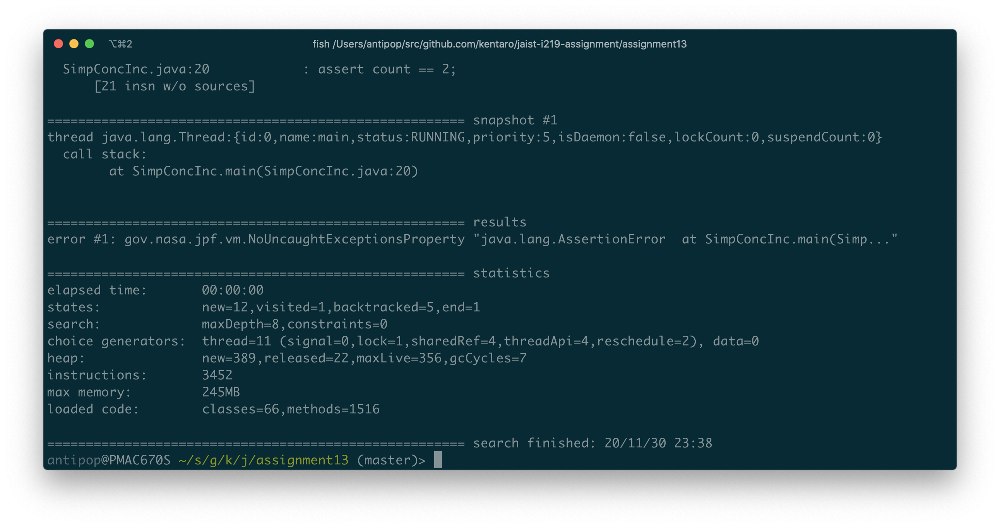

以下の通り、アサーションエラーで終了する。

```
====================================================== snapshot #1
thread java.lang.Thread:{id:0,name:main,status:RUNNING,priority:5,isDaemon:false,lockCount:0,suspendCount:0}
  call stack:
	at SimpConcInc.main(SimpConcInc.java:20)


====================================================== results
error #1: gov.nasa.jpf.vm.NoUncaughtExceptionsProperty "java.lang.AssertionError  at SimpConcInc.main(Simp..."
```

スレッドの実行の様子は以下の通りである（競合に関係する箇所のみ抜粋）。

```
====================================================== trace #1
------------------------------------------------------ transition #1 thread: 1
gov.nasa.jpf.vm.choice.ThreadChoiceFromSet {id:"START" ,2/2,isCascaded:false}
      [1 insn w/o sources]
  SimpConcInc.java:1             : public class SimpConcInc extends Thread {
  SimpConcInc.java:5             : count++;
------------------------------------------------------ transition #2 thread: 0
gov.nasa.jpf.vm.choice.ThreadChoiceFromSet {id:"SHARED_CLASS" ,1/2,isCascaded:false}
      [2 insn w/o sources]
  SimpConcInc.java:11            : count++;
------------------------------------------------------ transition #3 thread: 0
gov.nasa.jpf.vm.choice.ThreadChoiceFromSet {id:"SHARED_CLASS" ,1/2,isCascaded:false}
  SimpConcInc.java:11            : count++;
------------------------------------------------------ transition #4 thread: 1
gov.nasa.jpf.vm.choice.ThreadChoiceFromSet {id:"SHARED_CLASS" ,2/2,isCascaded:false}
  SimpConcInc.java:5             : count++;
------------------------------------------------------ transition #5 thread: 0
gov.nasa.jpf.vm.choice.ThreadChoiceFromSet {id:"SHARED_CLASS" ,1/2,isCascaded:false}
  SimpConcInc.java:11            : count++;
  SimpConcInc.java:12            : t.join();
      [1 insn w/o sources]
------------------------------------------------------ transition #6 thread: 1
gov.nasa.jpf.vm.choice.ThreadChoiceFromSet {id:"JOIN" ,1/1,isCascaded:false}
  SimpConcInc.java:5             : count++;
  SimpConcInc.java:6             : }
  SimpConcInc.java:4             : public void run() {
```

ふたつのスレッドによる各transitionのフローは以下の通りである（競合に関係する箇所のみ抜粋）。

* transition #1: `thread: 1`が`count`から`0`を読み出し
* transition #2: `thread: 0`が`count`から`0`を読み出し
* transition #3: `thread: 0`が`count`をインクリメント
* transition #4: `thread: 1`が`count`をインクリメント
* transition #5: `thread: 0`が`count`に`1`を書き込み
* transition #6: `thread: 1`が`count`に`1`を書き込み

`thread: 0`（メインスレッド）と`thread: 1`との間で`count`変数に対する競合が起こっている。結果としてアサーション時には`count`の値は`1`になるため、エラーが発生する。

## `UnsafeInc`

カウンターのクラス`FCounter`を2つのスレッドで共有する`UnsafeInc`を実行する。

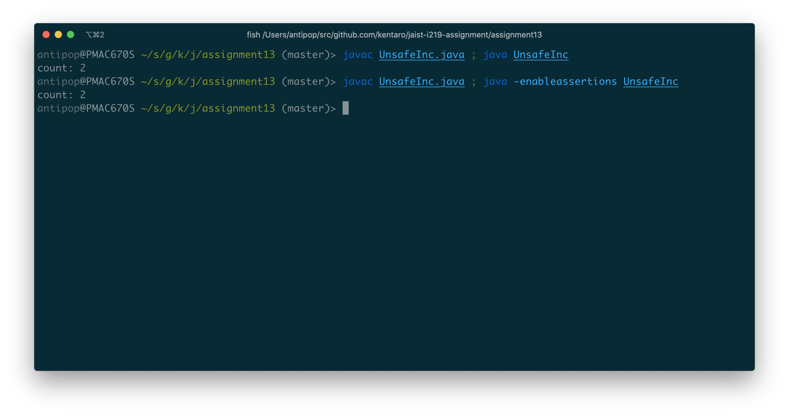

上記の通り、`count: 2`が表示される。`-enableassertions`オプションをつけて実行してもエラーが起こらないため、一見すると正しく実行されているかのように見える。

`UnsafeInc`をJPFで検査する。

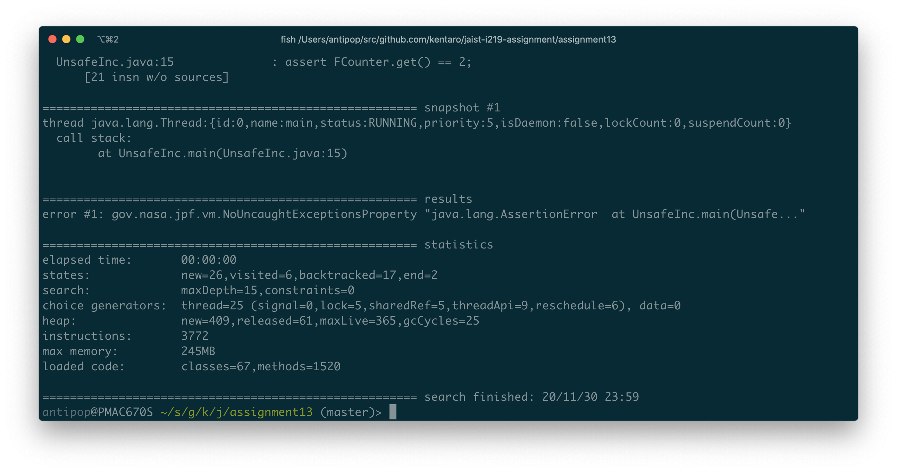

以下の通り、アサーションエラーで終了する。

```
====================================================== snapshot #1
thread java.lang.Thread:{id:0,name:main,status:RUNNING,priority:5,isDaemon:false,lockCount:0,suspendCount:0}
  call stack:
	at UnsafeInc.main(UnsafeInc.java:15)


====================================================== results
error #1: gov.nasa.jpf.vm.NoUncaughtExceptionsProperty "java.lang.AssertionError  at UnsafeInc.main(Unsafe..."
```

ふたつのスレッドによる各transitionのフローは以下の通りである（競合に関係する箇所のみ抜粋）。

```
====================================================== trace #1
------------------------------------------------------ transition #7 thread: 2
gov.nasa.jpf.vm.choice.ThreadChoiceFromSet {id:"LOCK" ,2/2,isCascaded:false}
  UnsafeInc.java:3               : (new FCounter()).inc();
  FCounter.java:15               : x++;
------------------------------------------------------ transition #8 thread: 1
gov.nasa.jpf.vm.choice.ThreadChoiceFromSet {id:"SHARED_CLASS" ,1/2,isCascaded:false}
  UnsafeInc.java:3               : (new FCounter()).inc();
  FCounter.java:15               : x++;
------------------------------------------------------ transition #9 thread: 1
gov.nasa.jpf.vm.choice.ThreadChoiceFromSet {id:"SHARED_CLASS" ,1/2,isCascaded:false}
  FCounter.java:15               : x++;
------------------------------------------------------ transition #10 thread: 2
gov.nasa.jpf.vm.choice.ThreadChoiceFromSet {id:"SHARED_CLASS" ,2/2,isCascaded:false}
  FCounter.java:15               : x++;
------------------------------------------------------ transition #11 thread: 1
gov.nasa.jpf.vm.choice.ThreadChoiceFromSet {id:"SHARED_CLASS" ,1/2,isCascaded:false}
  FCounter.java:15               : x++;
  FCounter.java:16               : }
------------------------------------------------------ transition #13 thread: 2
gov.nasa.jpf.vm.choice.ThreadChoiceFromSet {id:"JOIN" ,1/1,isCascaded:false}
  FCounter.java:15               : x++;
  FCounter.java:16               : }
```

ふたつのスレッドによる各transitionのフローは以下の通りである。

* transition #7: `thread: 2`が`x`から`0`を読み出し
* transition #8: `thread: 1`が`x`から`0`を読み出し
* transition #9: `thread: 1`が`x`をインクリメント
* transition #10: `thread: 2`が`x`をインクリメント
* transition #11: `thread: 1`が`x`に`1`を書き込み
* transition #13: `thread: 2`が`x`に`1`を書き込み

`thread: 1`と`thread: 2`との間で`FCounter`クラスのスタティック変数`x`に対する競合が起こっている。結果としてアサーション時には`count`の値は`1`になるため、エラーが発生する。

`UnsafeInc`では、スレッドが`FCounter`オブジェクトをそれぞれ作り、それぞれのオブジェクトに対してロックを取っているため、`FCounter`のスタティック変数`x`に対してはインクリメント処理が競合してしまうためである。

## `SafeInc`

カウンターのクラス`GCounter`を2つのスレッドで共有する`SafeInc`を実行する。


上記の通り、`count: 2`が表示される。

次に、`SafeInc`をJPFで検査する。


以下の通り、エラーなく終了する。

```
====================================================== results
no errors detected
```

`FCounter`と違い、ふたつのスレッドそれぞれが`GCounter`のスタティック変数`lock`で示されるオブジェクトに対してロックを取った上でインクリメントを実行するため、同期が適切に行われる。

## `SafeInc2`

カウンターのクラス`Counter`を2つのスレッドで共有する`SafeInc2`を実行する。

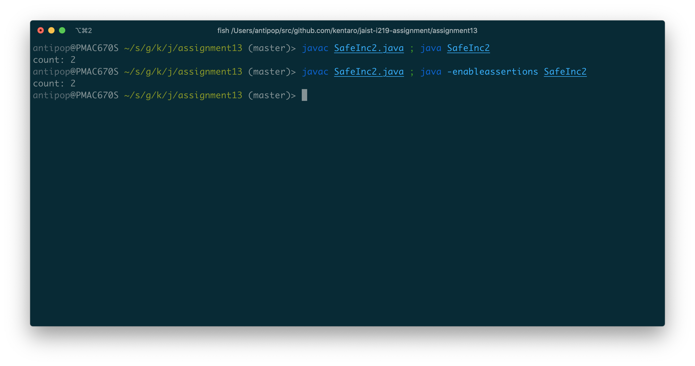

上記の通り、`count: 2`が表示される。

`SafeInc2`をJPFで検査する。

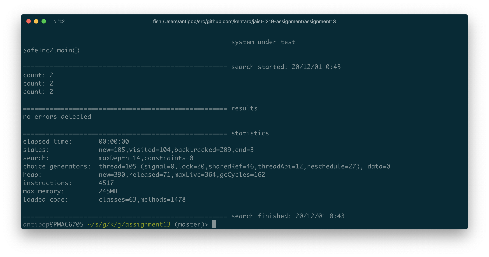

以下の通り、エラーなく終了する。

```
====================================================== results
no errors detected
```

ふたつのスレッドそれぞれが、スタティック変数`counter`として宣言された`Counter`オブジェクトを共有しているが、`Counter`クラスでは変数`x`がスタティックではなく、かつ、インクリメントする`inc`メソッドが同期されている。それぞれのスレッドは`counter`オブジェクトに対してロックを取った上でインクリメントを実行するため、同期が適切に行われる。

## Bounded Buffer Problem

前回実装したBounded Buffer Problemを実装したクラス群と`BBProb`を実行する。

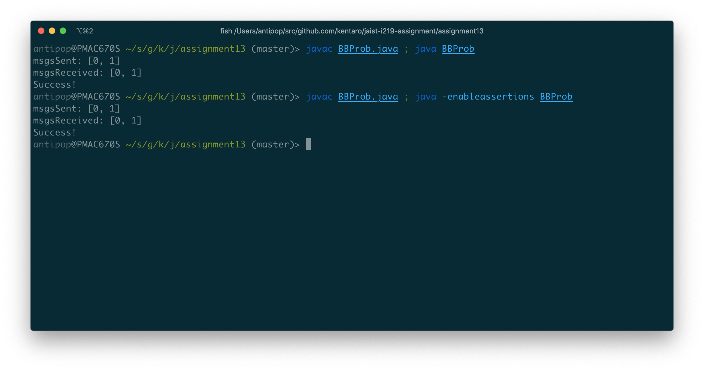

上記の通り、問題なく処理が成功して終了する。

`BBProb`をJPFで検査する。

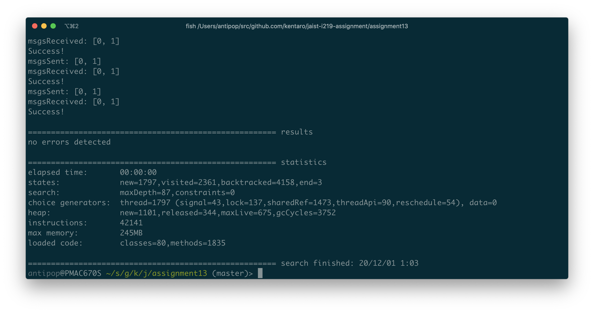

以下の通り、エラーなく終了する。

```
====================================================== results
no errors detected
```

次に、送信されたメッセージを`log`変数に記録しておくように改修した`MonitorBBuf2`をバッファとして使うようにした`Sender2`および`Receiver2`を用いて、メッセージを送る`Sender2`を2つにした`BBProb2`を実行する。

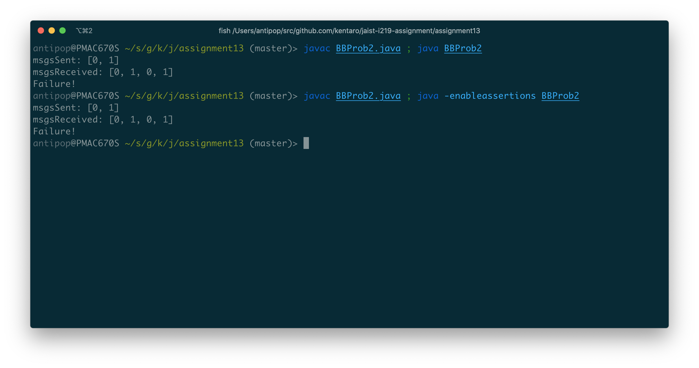

上記の通り、問題なく処理が成功して終了する。

`BBProb2`をJPFで検査する。

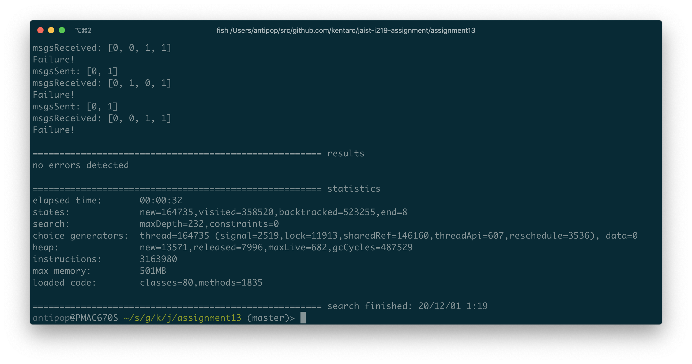

以下の通り、エラーなく終了する。

```
====================================================== results
no errors detected
```

さらに、上記とほぼ変わらないが、メッセージを`put`する際に`while`で待つところを`if`に変更した`FMonitorBBuf1`をバッファとして用いるSender/Receiverを使う`FBBProb1`を実行する。

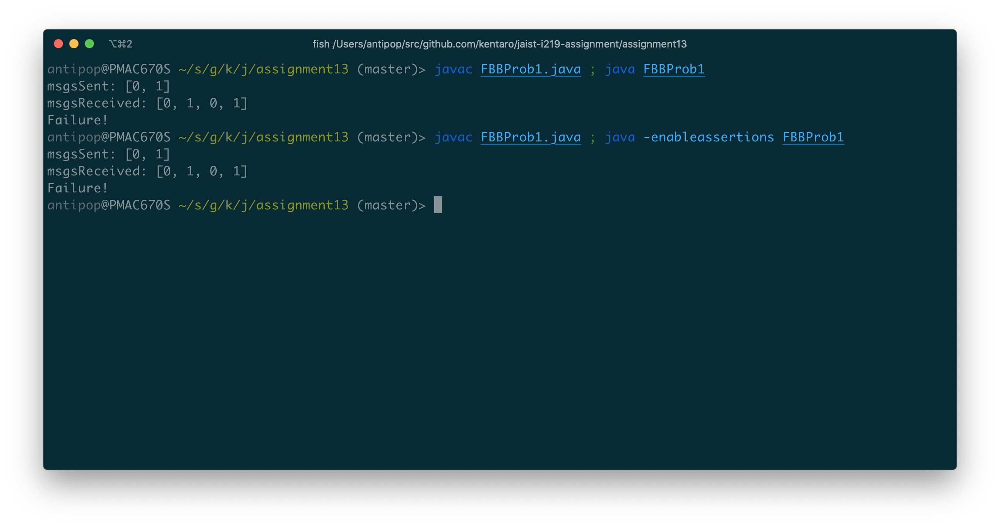

上記の通り、メッセージを適切に送受信することに失敗している。

`FBBProb1`をJPFで検査する。

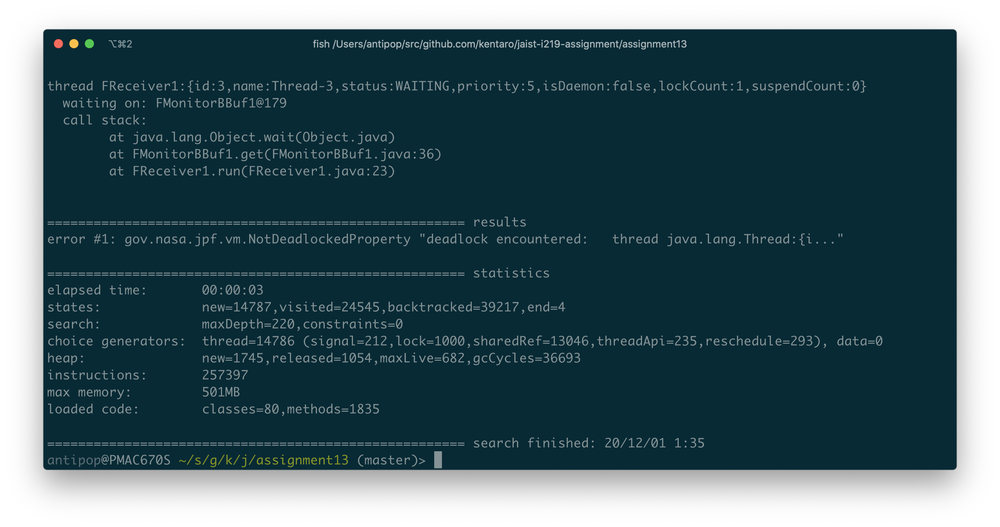

以下の通り、デッドロックを検出する。

```
====================================================== results
error #1: gov.nasa.jpf.vm.NotDeadlockedProperty "deadlock encountered:   thread java.lang.Thread:{i..."
```

3つのスレッドによる各transitionのフローは以下の通りである（競合に関係する箇所のみ抜粋）。

```
------------------------------------------------------ transition #72 thread: 1
gov.nasa.jpf.vm.choice.ThreadChoiceFromSet {id:"SHARED_OBJECT" ,1/3,isCascaded:false}
  FMonitorBBuf1.java:22          : if (noe >= capacity) {
  FMonitorBBuf1.java:23          : this.wait();
      [1 insn w/o sources]
------------------------------------------------------ transition #82 thread: 2
gov.nasa.jpf.vm.choice.ThreadChoiceFromSet {id:"SHARED_OBJECT" ,1/2,isCascaded:false}
  FMonitorBBuf1.java:22          : if (noe >= capacity) {
  FMonitorBBuf1.java:23          : this.wait();
      [1 insn w/o sources]
------------------------------------------------------ transition #83 thread: 3
gov.nasa.jpf.vm.choice.ThreadChoiceFromSet {id:"WAIT" ,1/1,isCascaded:false}
      [1 insn w/o sources]
  FReceiver1.java:1              : /**
  FReceiver1.java:21             : for (int i = 0; i < nom; i++) {
  FReceiver1.java:23             : msgs.add(buf.get());
  FMonitorBBuf1.java:35          : while (noe <= 0) {
  FMonitorBBuf1.java:39          : if (noe > 0) {
  FMonitorBBuf1.java:40          : E e = queue.top();
  NeQueue.java:25                : return head;
  FMonitorBBuf1.java:40          : E e = queue.top();
  FMonitorBBuf1.java:41          : queue = queue.deq();
  NeQueue.java:21                : return tail;
  FMonitorBBuf1.java:41          : queue = queue.deq();
  FMonitorBBuf1.java:42          : noe--;
  FMonitorBBuf1.java:43          : this.notifyAll();
      [2 insn w/o sources]
  FMonitorBBuf1.java:44          : return e;
------------------------------------------------------ transition #85 thread: 1
gov.nasa.jpf.vm.choice.ThreadChoiceFromSet {id:"SHARED_OBJECT" ,1/2,isCascaded:false}
  FMonitorBBuf1.java:26          : if (noe < capacity) {
  FMonitorBBuf1.java:27          : queue = queue.enq(e);
------------------------------------------------------ transition #110 thread: 2
gov.nasa.jpf.vm.choice.ThreadChoiceFromSet {id:"SHARED_OBJECT" ,1/2,isCascaded:false}
  FMonitorBBuf1.java:26          : if (noe < capacity) {
  FMonitorBBuf1.java:32          : }
  FSender1.java:24               : }
  FSender1.java:19               : for (int i = 0; i < msgs.size(); i++) {
------------------------------------------------------ transition #114 thread: 3
gov.nasa.jpf.vm.choice.ThreadChoiceFromSet {id:"JOIN" ,1/1,isCascaded:false}
  FMonitorBBuf1.java:44          : return e;
  FReceiver1.java:23             : msgs.add(buf.get());
      [110 insn w/o sources]
  FReceiver1.java:23             : msgs.add(buf.get());
  FReceiver1.java:26             : }
  FReceiver1.java:21             : for (int i = 0; i < nom; i++) {
  FReceiver1.java:23             : msgs.add(buf.get());
  FMonitorBBuf1.java:35          : while (noe <= 0) {
  FMonitorBBuf1.java:39          : if (noe > 0) {
  FMonitorBBuf1.java:40          : E e = queue.top();
  NeQueue.java:25                : return head;
  FMonitorBBuf1.java:40          : E e = queue.top();
  FMonitorBBuf1.java:41          : queue = queue.deq();
  NeQueue.java:21                : return tail;
  FMonitorBBuf1.java:41          : queue = queue.deq();
  FMonitorBBuf1.java:42          : noe--;
  FMonitorBBuf1.java:43          : this.notifyAll();
      [2 insn w/o sources]
  FMonitorBBuf1.java:44          : return e;
  FReceiver1.java:23             : msgs.add(buf.get());
      [44 insn w/o sources]
  FReceiver1.java:23             : msgs.add(buf.get());
  FReceiver1.java:26             : }
  FReceiver1.java:21             : for (int i = 0; i < nom; i++) {
  FReceiver1.java:23             : msgs.add(buf.get());
  FMonitorBBuf1.java:35          : while (noe <= 0) {
  FMonitorBBuf1.java:39          : if (noe > 0) {
  FMonitorBBuf1.java:40          : E e = queue.top();
  NeQueue.java:25                : return head;
  FMonitorBBuf1.java:40          : E e = queue.top();
  FMonitorBBuf1.java:41          : queue = queue.deq();
  NeQueue.java:21                : return tail;
  FMonitorBBuf1.java:41          : queue = queue.deq();
  FMonitorBBuf1.java:42          : noe--;
  FMonitorBBuf1.java:43          : this.notifyAll();
      [2 insn w/o sources]
  FMonitorBBuf1.java:44          : return e;
  FReceiver1.java:23             : msgs.add(buf.get());
      [44 insn w/o sources]
  FReceiver1.java:23             : msgs.add(buf.get());
  FReceiver1.java:26             : }
  FReceiver1.java:21             : for (int i = 0; i < nom; i++) {
  FReceiver1.java:23             : msgs.add(buf.get());
  FMonitorBBuf1.java:35          : while (noe <= 0) {
  FMonitorBBuf1.java:36          : this.wait();
      [1 insn w/o sources]
```

3つのスレッドによる各transitionのフローは以下の通りである。

* transition #72: `thread: 1`（`sender1`）が`this.wait()`で待つ
* transition #82: `thread: 2`（`sender2`）が`this.wait()`で待つ
* transition #83: `thread: 3`（`receiver`）が`this.notifyAll()`を実行する
* transition #85: `thread: 1`（`sender1`）がキューにメッセージを送信する
* transition #110: `thread: 2`（`sender2`）はキューにメッセージを送信できない
* transition #13: `thread: 3`（`receiver`）は`notifyAll()`を待ち続ける

`receiver`が`notifyAll()`を実行したあと、`sender1`がロックを取りメッセージを送信する。`sender2`はその後にロックを取るが、その際には`FMonitorBBuf1`の`if (noe < capacity) {`の箇所が`true`になることはなく、`sender2`はメッセージを送信することなく、`this.notifyAll()`を実行することはない。そのため、`this.wait()`で待ちに入った`receiver`スレッドが起きることはなくなり、デッドロックになってしまう。

最後に、`MonitorBBuf2`で、メッセージを`get`する際に`while`で待つ条件を`noe <= 0`から`noe < 0`に変更した`FMonitorBBuf2`をバッファとして用いるSender/Receiverを使う`FBBProb2`を実行する。

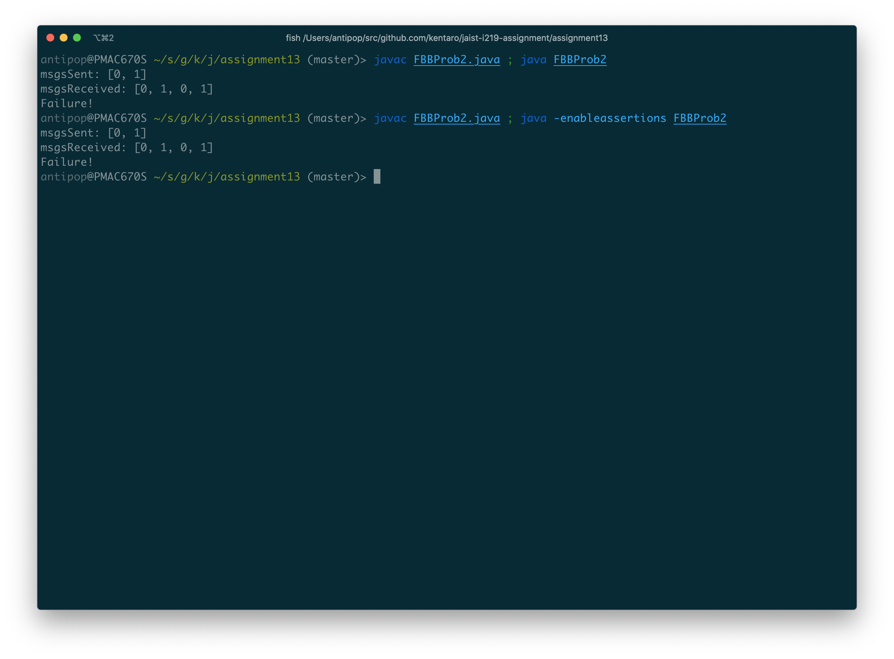

上記の通り、メッセージを適切に送受信することに失敗している。

`FBBProb2`をJPFで検査する。

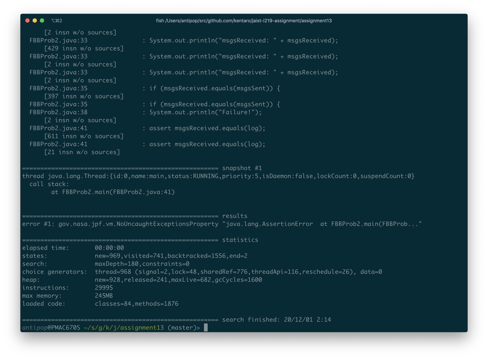

以下の通り、アサーションエラーで終了する。

```
====================================================== snapshot #1
thread java.lang.Thread:{id:0,name:main,status:RUNNING,priority:5,isDaemon:false,lockCount:0,suspendCount:0}
  call stack:
	at FBBProb2.main(FBBProb2.java:41)


====================================================== results
error #1: gov.nasa.jpf.vm.NoUncaughtExceptionsProperty "java.lang.AssertionError  at FBBProb2.main(FBBProb..."
```

以下の通り、`while`で待つ条件が`0`未満となっているために`0`の際に待たなくなってしまうため、適切に処理が行われなくなってしまう。

```
------------------------------------------------------ transition #130 thread: 3
gov.nasa.jpf.vm.choice.ThreadChoiceFromSet {id:"LOCK" ,2/2,isCascaded:false}
  FReceiver2.java:23             : msgs.add(buf.get());
  FMonitorBBuf2.java:35          : while (noe < 0) {
  FMonitorBBuf2.java:39          : if (noe > 0) {
  FMonitorBBuf2.java:46          : return null;
```
