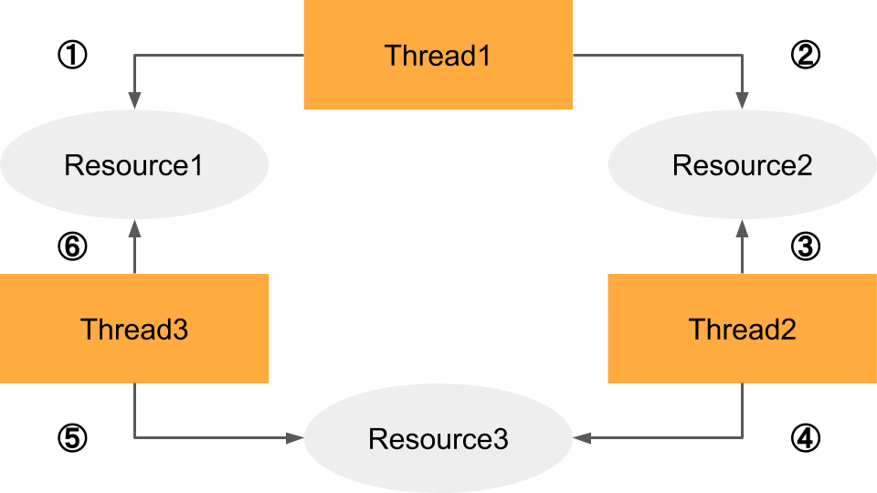
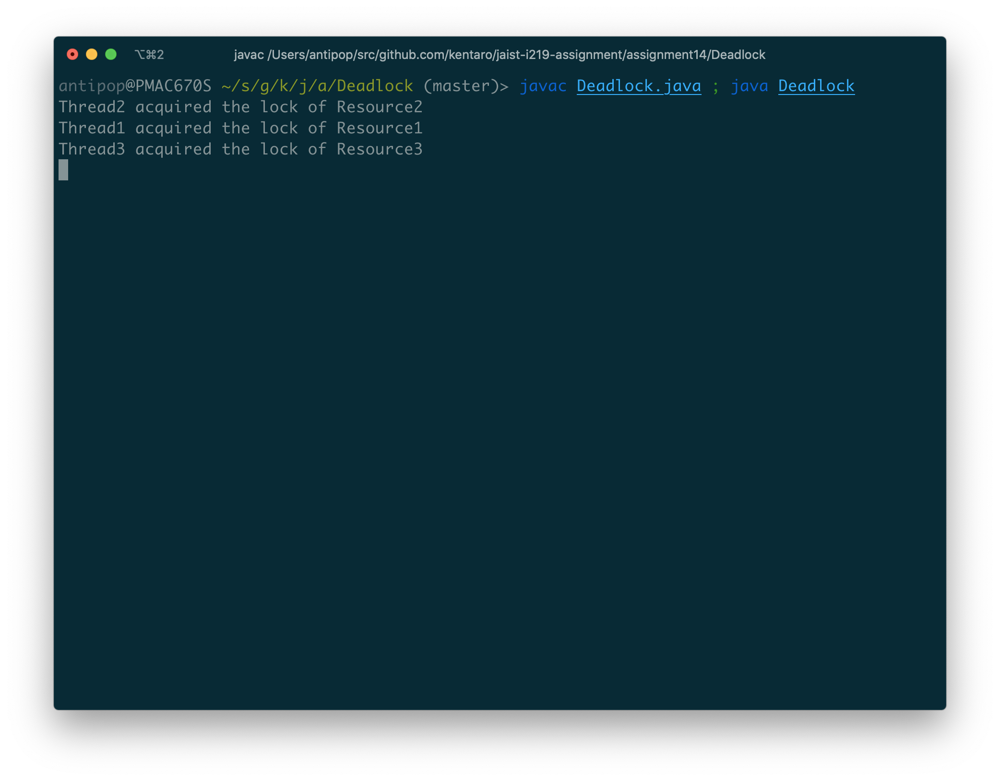
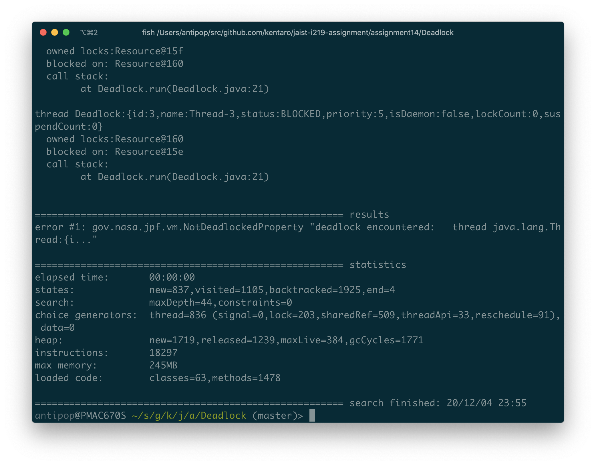
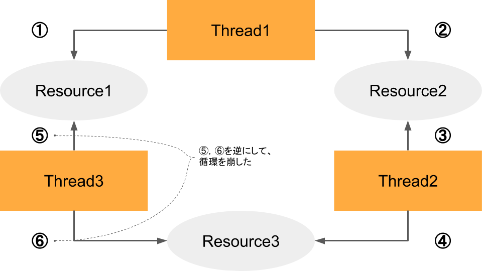
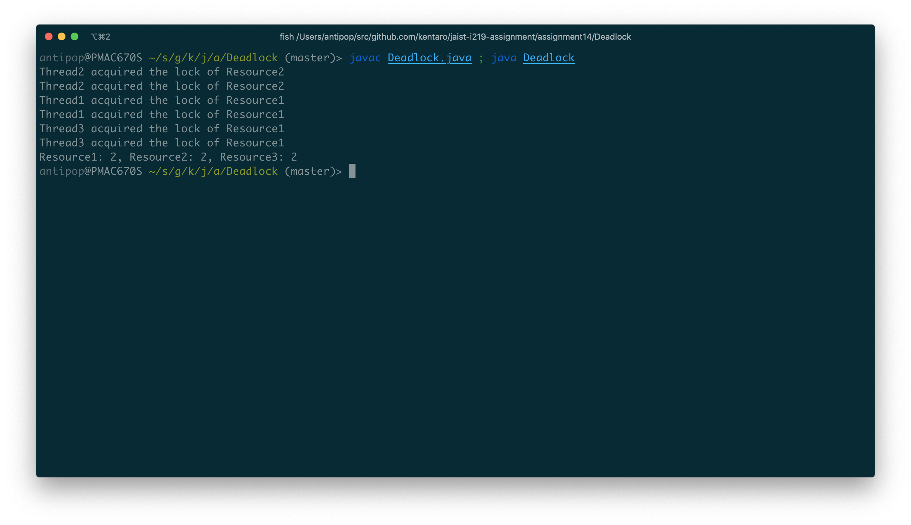
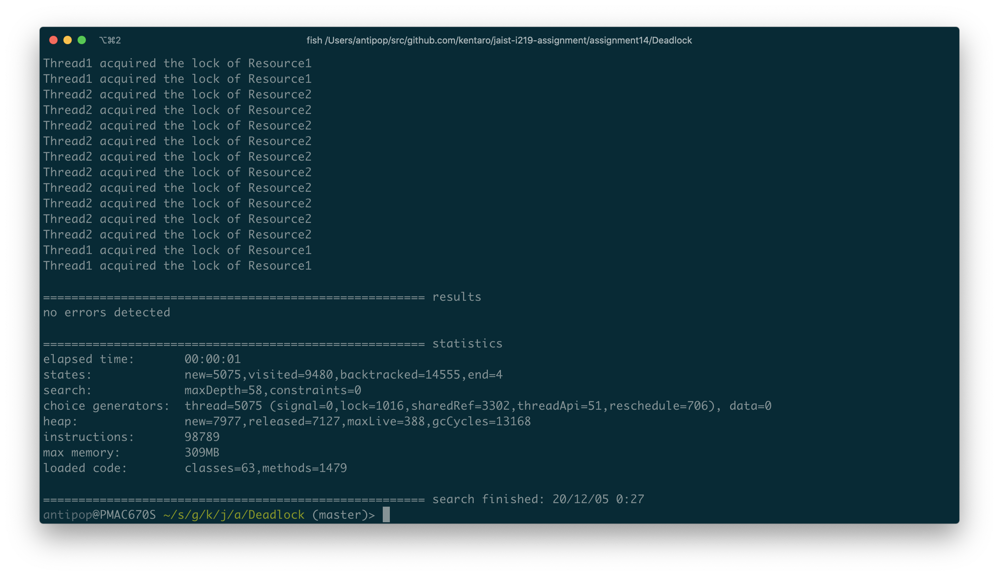
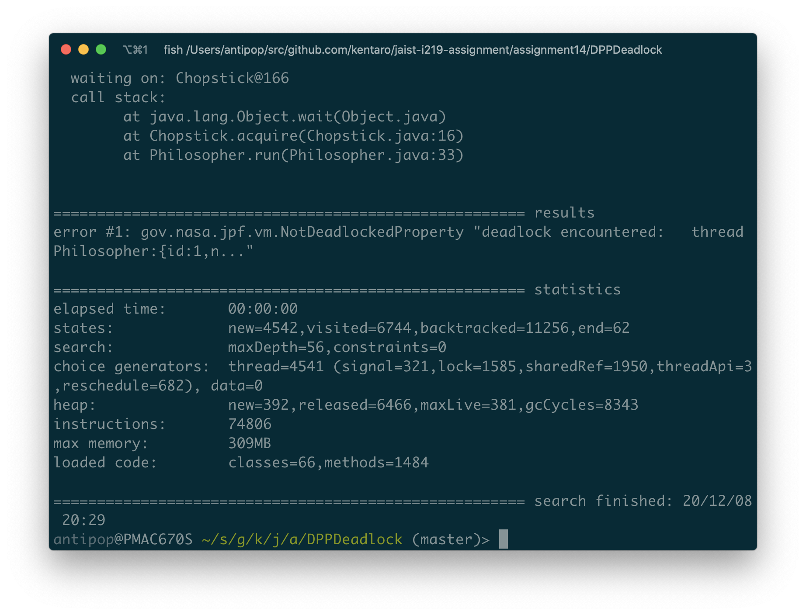
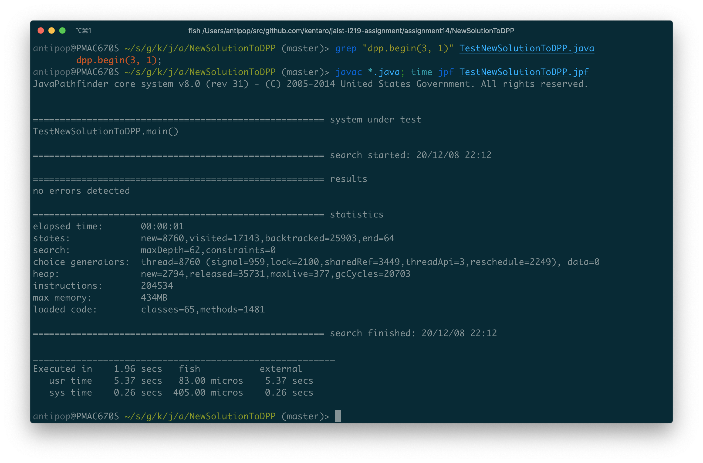
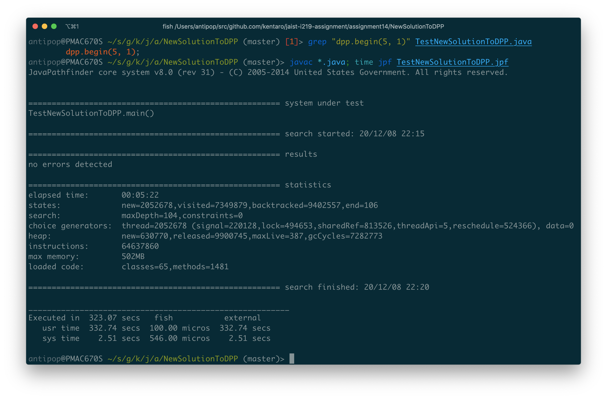

# Assignment 14

* 氏名: 栗林健太郎
* 学生番号: 2030006
* 作成日: 2020年12月4日

## `Deadlock`

3つのスレッドと3つのリソースがある状態で、それぞれのスレッドは隣り合うリソースを確保して処理を行う`Deadlock`クラスについて検討する。

### `Deadclass`クラスの実行

`Deadlock.java`に含まれているコードは、以下の図の通りリソースを循環的に参照しているため、デッドロックが発生する。



`Deadlock`クラスを実行すると、以下の通りデッドロックとなる。



### `Deadclass`クラスの解析

JPFを実行すると、以下の通りデッドロックが検出された。



以下に、デッドロックに関するtransitionを抜粋する。

```
------------------------------------------------------ transition #6 thread: 1
gov.nasa.jpf.vm.choice.ThreadChoiceFromSet {id:"LOCK" ,1/3,isCascaded:false}
  Deadlock.java:19               : synchronized(resource1) {
  Deadlock.java:20               : System.out.println(name + " acquired the lock of " + resource1.getName());
      [2 insn w/o sources]
  Deadlock.java:20               : System.out.println(name + " acquired the lock of " + resource1.getName());
------------------------------------------------------ transition #10 thread: 1
gov.nasa.jpf.vm.choice.ThreadChoiceFromSet {id:"SHARED_OBJECT" ,1/3,isCascaded:false}
  Deadlock.java:21               : synchronized(resource2) {
------------------------------------------------------ transition #11 thread: 2
gov.nasa.jpf.vm.choice.ThreadChoiceFromSet {id:"LOCK" ,2/3,isCascaded:false}
      [1 insn w/o sources]
  Deadlock.java:1                : /**
  Deadlock.java:19               : synchronized(resource1) {
------------------------------------------------------ transition #17 thread: 2
gov.nasa.jpf.vm.choice.ThreadChoiceFromSet {id:"SHARED_OBJECT" ,1/2,isCascaded:false}
  Deadlock.java:21               : synchronized(resource2) {
------------------------------------------------------ transition #18 thread: 3
gov.nasa.jpf.vm.choice.ThreadChoiceFromSet {id:"LOCK" ,2/2,isCascaded:false}
      [1 insn w/o sources]
  Deadlock.java:1                : /**
  Deadlock.java:19               : synchronized(resource1) {
------------------------------------------------------ transition #20 thread: 3
gov.nasa.jpf.vm.choice.ThreadChoiceFromSet {id:"LOCK" ,2/2,isCascaded:false}
  Deadlock.java:21               : synchronized(resource2) {
.run(Deadlock.java:21)
```

上記のtransitionの内容は以下の通りである。

1. Thread1がResource1のロックを確保
2. Thread2がResource2のロックを確保
3. Thread3がResource3のロックを確保
4. Thread1がResource2のロックを待つ
5. Thread2がResource3のロックを待つ
6. Thread3がResource1のロックを待つ

このため、`Deadlock`クラスの実行によってデッドロックが発生する。

ちなみに、下図のように、たとえばThread3のロック確保順を逆にして循環を崩すと、デッドロックせずにプログラムが終了する。



実行結果は以下の通りである。



JPFを実行しても、デッドロックは検出されない。



## `DiningPhilosopherProblem`

`DiningPhilosopherProblem`を下記のように変更することで、デッドロックが起こることを確認した。

```
// changed the argument `n - 1` to `n`
// to confirm it if causes a deadlock.
DiningRoom dr = new DiningRoom(n);
```

JPFで検査すると、以下の通りデッドロックが検出された。



以下に、デッドロックに関するtransitionを抜粋する。

```
------------------------------------------------------ transition #8 thread: 1
gov.nasa.jpf.vm.choice.ThreadChoiceFromSet {id:"LOCK" ,1/3,isCascaded:false}
  Philosopher.java:27            : droom.enter();
  DiningRoom.java:17             : if (howManyPeopleCanEnter > cnt) {
  DiningRoom.java:18             : cnt++;
  DiningRoom.java:24             : }
  Philosopher.java:28            : } catch (InterruptedException e) {}
  Philosopher.java:30            : left.acquire();
------------------------------------------------------ transition #9 thread: 1
gov.nasa.jpf.vm.choice.ThreadChoiceFromSet {id:"LOCK" ,1/3,isCascaded:false}
  Philosopher.java:30            : left.acquire();
  Chopstick.java:15              : while (beingUsed) {
  Chopstick.java:18              : beingUsed = true;
  Chopstick.java:19              : }
  Philosopher.java:31            : } catch (InterruptedException e) {}
  Philosopher.java:33            : right.acquire();
------------------------------------------------------ transition #14 thread: 2
gov.nasa.jpf.vm.choice.ThreadChoiceFromSet {id:"SHARED_OBJECT" ,2/3,isCascaded:false}
  DiningRoom.java:18             : cnt++;
  DiningRoom.java:24             : }
  Philosopher.java:28            : } catch (InterruptedException e) {}
  Philosopher.java:30            : left.acquire();
------------------------------------------------------ transition #15 thread: 2
gov.nasa.jpf.vm.choice.ThreadChoiceFromSet {id:"LOCK" ,2/3,isCascaded:false}
  Philosopher.java:30            : left.acquire();
  Chopstick.java:15              : while (beingUsed) {
------------------------------------------------------ transition #16 thread: 2
gov.nasa.jpf.vm.choice.ThreadChoiceFromSet {id:"SHARED_OBJECT" ,1/2,isCascaded:false}
  Chopstick.java:15              : while (beingUsed) {
  Chopstick.java:18              : beingUsed = true;
------------------------------------------------------ transition #17 thread: 2
gov.nasa.jpf.vm.choice.ThreadChoiceFromSet {id:"SHARED_OBJECT" ,1/2,isCascaded:false}
  Chopstick.java:18              : beingUsed = true;
  Chopstick.java:19              : }
------------------------------------------------------ transition #19 thread: 1
gov.nasa.jpf.vm.choice.ThreadChoiceFromSet {id:"SHARED_OBJECT" ,1/3,isCascaded:false}
  Chopstick.java:15              : while (beingUsed) {
  Chopstick.java:16              : this.wait();
      [1 insn w/o sources]
------------------------------------------------------ transition #20 thread: 2
gov.nasa.jpf.vm.choice.ThreadChoiceFromSet {id:"WAIT" ,1/2,isCascaded:false}
  Chopstick.java:19              : }
  Philosopher.java:31            : } catch (InterruptedException e) {}
  Philosopher.java:33            : right.acquire();
------------------------------------------------------ transition #26 thread: 3
gov.nasa.jpf.vm.choice.ThreadChoiceFromSet {id:"LOCK" ,2/2,isCascaded:false}
  Philosopher.java:30            : left.acquire();
  Chopstick.java:15              : while (beingUsed) {
  Chopstick.java:18              : beingUsed = true;
  Chopstick.java:19              : }
------------------------------------------------------ transition #27 thread: 2
gov.nasa.jpf.vm.choice.ThreadChoiceFromSet {id:"RELEASE" ,1/2,isCascaded:false}
  Philosopher.java:33            : right.acquire();
  Chopstick.java:15              : while (beingUsed) {
------------------------------------------------------ transition #28 thread: 2
gov.nasa.jpf.vm.choice.ThreadChoiceFromSet {id:"SHARED_OBJECT" ,1/2,isCascaded:false}
  Chopstick.java:15              : while (beingUsed) {
  Chopstick.java:16              : this.wait();
      [1 insn w/o sources]
------------------------------------------------------ transition #29 thread: 3
gov.nasa.jpf.vm.choice.ThreadChoiceFromSet {id:"WAIT" ,1/1,isCascaded:false}
  Chopstick.java:19              : }
  Philosopher.java:31            : } catch (InterruptedException e) {}
  Philosopher.java:33            : right.acquire();
  Chopstick.java:15              : while (beingUsed) {
  Chopstick.java:16              : this.wait();
      [1 insn w/o sources]
```

上記のtransitionの内容は以下の通りである。

1. `thread: 1`が、`transition #8`で左の箸を取り、`transition: 9`で右の箸を取ることを試みる
2. `thread: 2`が、`transiton #14-17`で左の箸を取る
3. そのため、`thread: 1`は`transition #18-19`で右の箸を取れるまで待つ
4. `thread: 2`が、`transition #20`で右の箸の箸を取ることを試みる
5. `thread: 3`が、`transition #26`左の箸を取る
6. そのため、`thread: 2`は`transition #28`で右の箸を取れるまで待つ
7. 最後に、`thread: 3`は`transition #29`で右の箸を取れるまで待つ

このため、`DiningPhilosopherProblem`クラスの実行によってデッドロックが発生する。

## `NewSolutionToDPP`

`DiningPhilosopherProblem`に対する別解を考える。`DiningPhilosopherProblem`は、ダイニングルームに入ることのできる人数を制限することで、デッドロックを防ぐアプローチであった。そのため、前述の通り、哲学者が`n`人いる場合に、`n-1`人ではなく`n`人全員がダイニングルームに入ることができるようにすると、デッドロックを引き起こす状況となった。

別解として、ダイニングルームへの人数制限を行わないアプローチについて考える。その場合、`Deadlock`のところで見た通り、リソースへの参照が循環性を持たないようにすることが必要である。そのため、奇数番目の哲学者はは左・右の順番で、偶数番目の哲学者は右・左の順番で箸を取るようにすることで、循環性を崩すようにした（実装の変更の主要な部分は以下の通り）。

また、循環性を壊すだけなら哲学者の内のひとりが右・左という順番で箸をとるだけでいいが、奇数・偶数にわけることで並行性をできるだけ損うことなく、デッドロックも回避できる。

```diff
7c7
< public class DiningPhilosopherProblem {
---
> public class NewSolutionToDPP {
11d10
<         DiningRoom dr = new DiningRoom(n);
16c15,16
<         for (int i = 0; i < (n - 1); i++) {
---
>         int i = 0;
>         for (i = 0; i < (n - 1); i++) {
19c19,23
<             (new Philosopher(m, left, right, dr)).start();
---
>             if (i % 2 == 0) {
>                 (new Philosopher(m, left, right)).start();
>             } else {
>                 (new Philosopher(m, right, left)).start();
>             }
23c27,32
<         (new Philosopher(m, left, right, dr)).start();
---
>
>         if (i % 2 == 0) {
>             (new Philosopher(m, left, right)).start();
>         } else {
>             (new Philosopher(m, right, left)).start();
>         }
```

上記の別解をJPFで検査する。

まず、哲学者が3人の場合で検査し、以下の通りエラーなく終了したことを確認した。



次に、哲学者が5人の場合でも検査し、以下の通りエラーなく終了したことを確認した。


