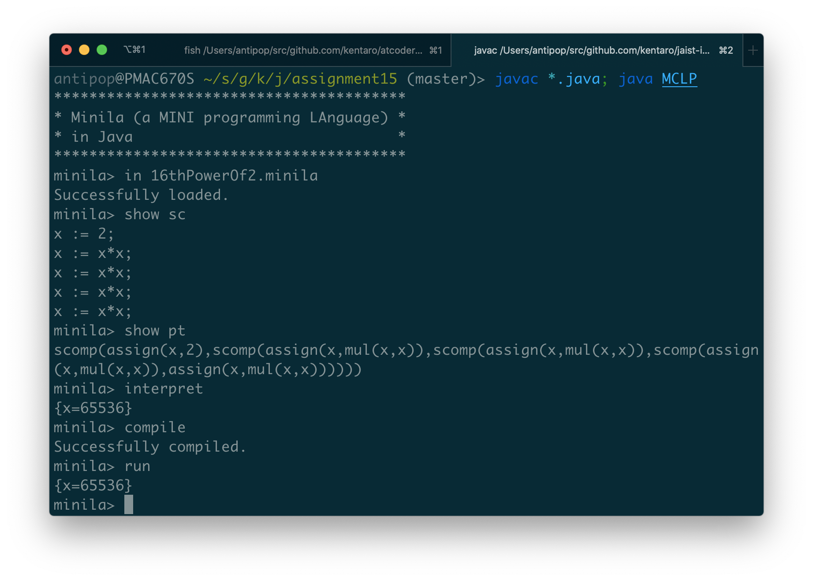
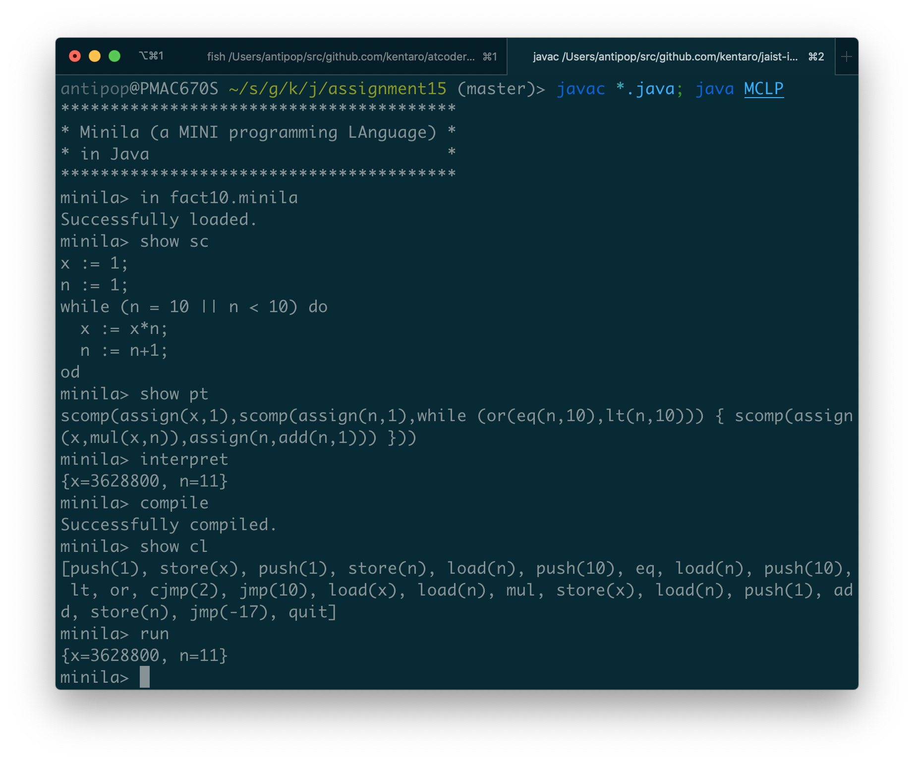
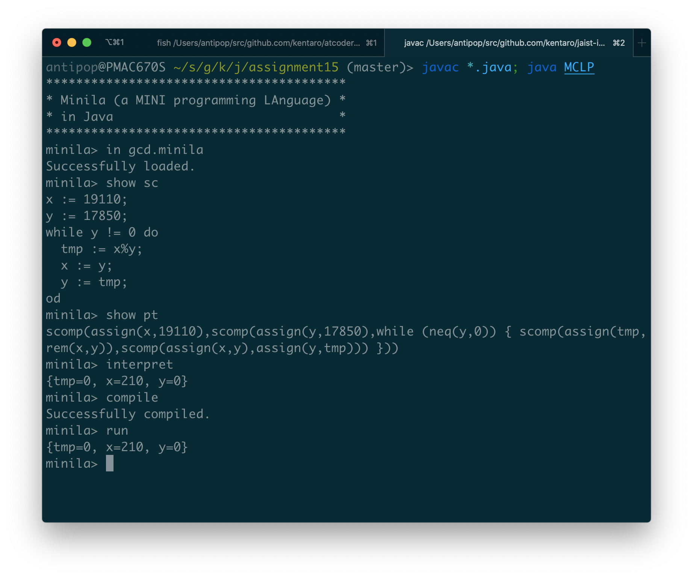
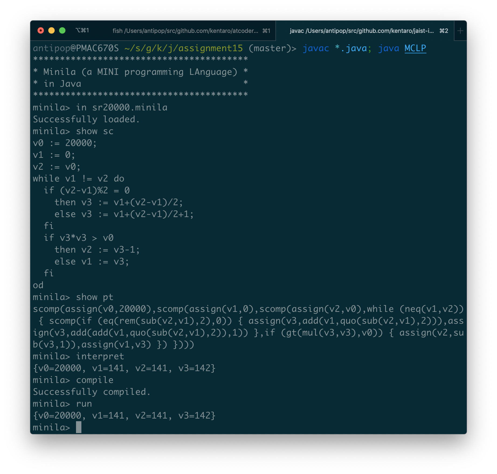

# Assignment 15

* 氏名: 栗林健太郎
* 学生番号: 2030006
* 作成日: 2020年12月17日

## Minila

本課題では、これまでの計算機実装を改良して、ミニ言語Minilaを実装する。本レポートでは、Assignment Calculatorとの差分について説明する。

### `IFParseTree`

`IFParseTree`は、条件分岐を表す構文木を実装している。

条件式を表す`ExpParseTree`、および、`if`節と`else`節それぞれを表す`StmParseTree`を持つ。

`compile()`メソッドは、コマンド列を作るに際して、1つの条件付きジャンプ命令と2つのジャンプ命令を用いる。

条件式の結果が真であれば、条件付きジャンプ命令によって`if`節の命令列へジャンプし、命令が実行される。そして、`else`節の次の命令列へジャンプする。条件式の結果が真でなければ、`else`節の命令列にジャンプし、命令が実行される。

### `WhileParseTree`

`WhileParseTree`は、繰り返しを表す構文木を実装している。

条件式を表す`ExpParseTree`、および、`while`の中身を表す`StmParseTree`を持つ。

`compile()`メソッドは、コマンド列を作るに際して、1つの条件付きジャンプ命令と2つのジャンプ命令を用いる。

条件式の結果が真であれば、条件付きジャンプ命令によって繰り返し実行の中身の命令列へジャンプし、命令が実行される。そして、実行後に条件式の命令列へジャンプする（戻る）。条件式の結果が真でなければ、繰り返し実行の中身に続く命令列にジャンプし、繰り返し実行は終了する。

### `VirtualMachine`

Assignment Calendarにおける同名のクラスとの差分は、以下の`diff`コマンドの出力の通りである。この出力の後に、命令の実行について述べる。

```diff
diff --git a/assignment15/VirtualMachine.java b/assignment15/VirtualMachine.java
index 876c449..816c689 100644
--- a/assignment15/VirtualMachine.java
+++ b/assignment15/VirtualMachine.java
@@ -16,6 +16,13 @@ public VirtualMachine(List<Command> cl) {
         comList = cl;
     }

+    public VirtualMachine(List<Command> cl, int pc, Stack<Integer> stk, Map<String, Integer> env) {
+        comList = cl;
+        this .pc = pc;
+        this.stk = stk;
+        this.env = env;
+    }
+
     public void reset(int pc, Stack<Integer> stk, Map<String, Integer> env) {
         this .pc = pc;
         this.stk = stk;
@@ -85,6 +92,18 @@ public void reset(int pc, Stack<Integer> stk, Map<String, Integer> env) {
                     stk.push(x);
                     pc++;
                     break;
+                case REM:
+                    if (stk.size() < 2) {
+                        throw new VMException(stk);
+                    }
+                    x2 = stk.top();
+                    stk.pop();
+                    x1 = stk.top();
+                    stk.pop();
+                    x = x1 % x2;
+                    stk.push(x);
+                    pc++;
+                    break;
                 case ADD:
                     if (stk.size() < 2) {
                         throw new VMException(stk);
@@ -109,6 +128,93 @@ public void reset(int pc, Stack<Integer> stk, Map<String, Integer> env) {
                     stk.push(x);
                     pc++;
                     break;
+                case LT:
+                    if (stk.size() < 2) {
+                        throw new VMException(stk);
+                    }
+                    x2 = stk.top();
+                    stk.pop();
+                    x1 = stk.top();
+                    stk.pop();
+                    x = x1 < x2 ? 1 : 0;
+                    stk.push(x);
+                    pc++;
+                    break;
+                case GT:
+                    if (stk.size() < 2) {
+                        throw new VMException(stk);
+                    }
+                    x2 = stk.top();
+                    stk.pop();
+                    x1 = stk.top();
+                    stk.pop();
+                    x = x1 > x2 ? 1 : 0;
+                    stk.push(x);
+                    pc++;
+                    break;
+                case EQ:
+                    if (stk.size() < 2) {
+                        throw new VMException(stk);
+                    }
+                    x2 = stk.top();
+                    stk.pop();
+                    x1 = stk.top();
+                    stk.pop();
+                    x = x1 == x2 ? 1 : 0;
+                    stk.push(x);
+                    pc++;
+                    break;
+                case NEQ:
+                    if (stk.size() < 2) {
+                        throw new VMException(stk);
+                    }
+                    x2 = stk.top();
+                    stk.pop();
+                    x1 = stk.top();
+                    stk.pop();
+                    x = x1 != x2 ? 1 : 0;
+                    stk.push(x);
+                    pc++;
+                    break;
+                case AND:
+                    if (stk.size() < 2) {
+                        throw new VMException(stk);
+                    }
+                    x2 = stk.top();
+                    stk.pop();
+                    x1 = stk.top();
+                    stk.pop();
+                    x = (x1 != 0 && x2 != 0) ? 1 : 0;
+                    stk.push(x);
+                    pc++;
+                    break;
+                case OR:
+                    if (stk.size() < 2) {
+                        throw new VMException(stk);
+                    }
+                    x2 = stk.top();
+                    stk.pop();
+                    x1 = stk.top();
+                    stk.pop();
+                    x = (x1 != 0 || x2 != 0) ? 1 : 0;
+                    stk.push(x);
+                    pc++;
+                    break;
+                case JMP:
+                    pc += com.getNum();
+                    break;
+                case CJMP:
+                    if (stk.size() < 1) {
+                        throw new VMException(stk);
+                    }
+                    x = stk.top();
+                    stk.pop();
+                    if (x != 0) {
+                        pc += com.getNum();
+                    } else {
+                        pc++;
+                    }
+                    break;
                 case QUIT:
                     if (stk.size() != 0) {
                         throw new VMException(stk, stk.size());
@@ -119,4 +225,8 @@ public void reset(int pc, Stack<Integer> stk, Map<String, Integer> env) {
             }
         }
     }
+
+    public String toString() {
+        return "pc: " + pc + ", stack: " + stk + ", env: " + env + ", cl: " + comList;
+    }
 }
```

#### `REM`, `LT`, `GT`, `EQ`, `NEQ`, `AND`, `OR`

それぞれ、剰余、小なり、大なり、等号、等号否定、AND、ORの演算を実行するための命令を処理する実装を行っている。それぞれ、スタックから2つの値を取り出し、対応するJavaの演算子を用いて演算し、結果をスタックに書き戻す。

#### `JMP`

ジャンプ命令を実行する処理を実装している。命令の引数に渡された数の分だけ`pc`に加算することで、ジャンプを実現する。

#### `CJMP`

条件付きジャンプ命令を実行する処理を実装している。スタックから値をひとつ取り出し、それが真（0でない数）なら命令の引数に渡された数の分だけ`pc`に加算することで、ジャンプをする。そうでない場合、`pc`を1つだけ進める。

### Minilaプログラムの実行

`*.minila`として配布されたMinilaプログラムについて、以下の通りそれぞれ正しく動作することを確認した。

#### `16thPowerOf2.minila`



#### `fact10.minila`



#### `gcd.minila`



#### `sr20000.minila`


