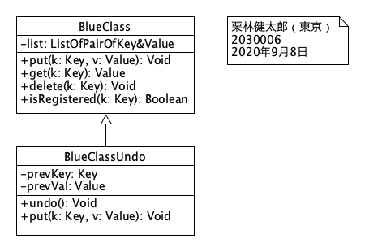
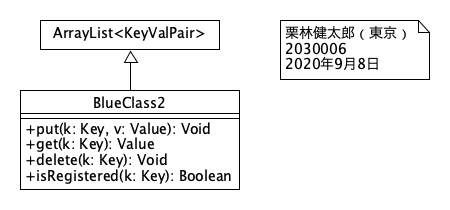
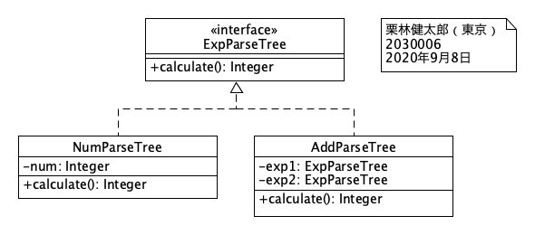
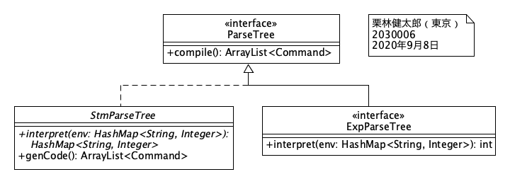
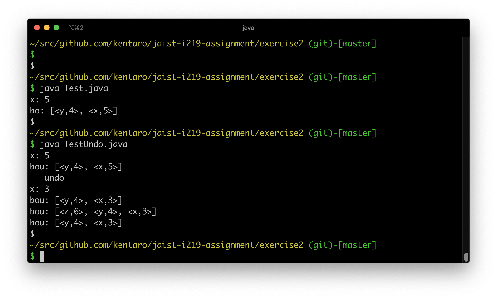

# Exercise 2

* 氏名: 栗林健太郎
* 学生番号: 2030006
* 作成日: 2020年9月8日

## `BlueClass`と`BlueClassUndo`との関係

上図は、`BlueClass`と`BlueClassUndo`との関係を示すクラス図である。

* `BlueClass`は:
  * プライベートフィールド`list: ListOfPairOfKey&Value`を持つ
  * パブリックメソッド`put(k: Key, v: Value): Void`、`get(k: Key): Value`、`delete(k: Key): Void`、`isRegistered(k: Key): Boolean`を持つ
* `BlueClassUndo`は:
  * `BlueClass`を汎化（Javaでは継承）している。すなわち、`BlueClassUndo`は親クラス`BlueClass`の子クラスである
  * プライベートフィールド`prevKey: Key`、`prevVal: Value`を持つ
  * パブリックメソッド`undo(): Void`、`put(k: Key, v: Value): Void`を持つ

## `ArrayList<KeyValPair>`と`BlueClass2`との関係

上図は、`ArrayList<KeyValPair>`と`BlueClass2`との関係を示すクラス図である。

* `BlueClass2`は:
  * `ArrayList<KeyValPair>`を汎化（Javaでは継承）している。すなわち、`BlueClass2`は親クラス`ArrayList<KeyValPair>`の子クラスである
  * パブリックメソッド`put(k: Key, v: Value): Void`、`get(k: Key): Value`、`delete(k: Key): Void`、`isRegistered(k: Key): Boolean`を持つ

## `ExpParseTree`と、`NumParseTree`および`AddParseTree`との関係

上図は、`ExpParseTree`と、`NumParseTree`および`AddParseTree`との関係を示すクラス図である。

* インタフェイス`ExpParseTree`は:
  * パブリックメソッド`calculate(): Integer`の実装を要請する
* `NumParseTree`は:
  * `ExpParseTree`を特化（Javaでは実装）している
  * プライベートフィールド`num: Integer`を持つ
  * パブリックメソッド`calculate(): Integer`を持つ
* `AddParseTree`は:
  * `ExpParseTree`を特化（Javaでは実装）している
  * プライベートフィールド`exp1: ExpParseTree`、`exp2: ExpParseTree`を持つ
  * パブリックメソッド`calculate(): Integer`を持つ

## `ParseTree`と、`StmParseTree`および`ExpParseTree`との関係

上図は、`ParseTree`と、`StmParseTree`および`ExpParseTree`との関係を示すクラス図である。

* インタフェイス`ParseTree`は:
  * パブリックメソッド`compile(): ArrayList<Command>`の実装を要請する
* 抽象クラス`StmParseTree`は:
  * `ParseTree`を特化（Javaでは実装）している
  * 抽象メソッド`interpret(env: HashMap<String, Integer>): HashMap<String, Integer>`を持つ
  * パブリックメソッド`genCode(): ArrayList<Command>`を持つ
* インタフェイス`ExpParseTree`は:
  * `ParseTree`を汎化（Javaでは継承）している
    * パブリックメソッド`interpret(): HashMap<String, Integer): int`を持つ

## プログラムの実行結果

以下の通り、Test.javaおよびTestUndo.javaを実行し、正しく動くことを確認した。

