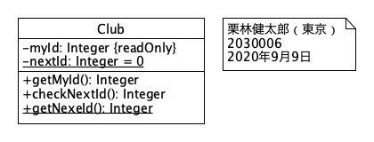

# Exercise 3

* 氏名: 栗林健太郎
* 学生番号: 2030006
* 作成日: 2020年9月16日

## 1. MapOfStringToInteger

`String`型と`Integer`型の値を紐付け、そのペアを`ArrayList<PairOfStringAndInteger>`型の属性として保持するクラスを示している。

## 2. SimpleMapOfStringToInteger

属性およびメソッドが省略されたクラスを示している。

## 3. MapOfStringToIntegerWithResponsibilities

メソッドが省略され、責務が記載されているクラスを示している。

## 4. SimpleMapOfStringToIntegerWithResponsibilities

属性もメソッドも省略され、クラス名と責務のみが記載されたクラスを示している。

## 5. StmParseTree

ひとつの抽象メソッドを持つ抽象クラスを示している。

## 6. SomeExceptions

例外を表す3つのクラスを示している。

## 7. TokenName

列挙型のクラスを示している。

## 8. ExpParseTree

インタフェイスを示している。

## 9. note

列挙型のクラスへのコメントを示している。

## 10. MapOfStringToIntegerAssociation

`MapOfStringToInteger`と`ArrayList<PairOfStringAndInteger>`との関連を示している。

プライベートフィールド`list`を通じてひとつの`ArrayList<PairOfStringAndInteger>`が関連付けられている。

## 11. MapOfStringToIntegerAssociation2

`MapOfStringToInteger`と`PairOfStringAndInteger`との関連を示している。

プライベートフィールド`list`を通じて、順序づけられた0以上の`PairOfStringAndInteger`が関連付けられている。

## 12. UndoMapOfStringToInteger

親クラス`MapOfStringToInteger`と、それを継承した子クラス`UndoMapOfStringToInteger`との継承関係を示している。

## 13. Num&AddExpParseTree

インタフェイス`ExpParseTree`を実装した2つのクラス`NumParseTree`と`AddParseTree`との実装関係を示している。

## 14. SimpleCalculator

`SimpleCalculator`がインタフェイス`ExpParseTree`を実装したクラスに依存している関係を示している。

## 15. providedInterface

インタフェイス`ExpParseTree`が、それぞれ`NumParseTree`および`AddParseTree`によって実装されていることを示す。

## 16. requiredInterface

`SimpleCalculator`が`ExpParseTree`インタフェイスを要求していることを示す。

## 17. SimpleCalculator2

`SimpleCalculator`はインタフェイス`ExpParseTree`を要求しており、それは`NumParseTree`および`AddParseTree`によって実装されていることを示す。

## 18. composition

`Bike`は2つのタイヤを部品として含むことを示している（全体と部分のライフサイクルが同じ）。

## 19. aggregation

`University`はゼロ以上の`Person`を含むことを示している（全体と部分のライフサイクルが異なる）。

## 20. ParseTree

足し算計算機プログラムを構成する構文木を表すクラス、インタフェイス、抽象クラス、例外の関係を示している。

## 21. Club

スタティック属性とスタティックメソッドを持つクラスを示している。

また、`myId`は読み取りのみであり、`nextId`のデフォルト値は0であることも示されている。

## 22. qualification

`MapOfStringToInteger`は、ひとつの`key`となる文字列に対して、ゼロ個あるいは1個の`Integer`を持つことを示す。

## 23. Pair

フィールド`k`および`v`の型が`K`および`V`としてパラメタ化された、ジェネリクスを用いた汎用的なクラスを示している。

## 24. objects

3つの図はそれぞれオブジェクトを示している。名前やクラス名はどちらかを省略することができる。また、属性の値を示すこともできる。

## 25. objectDiagram

オブジェクト間の関連を示している。
