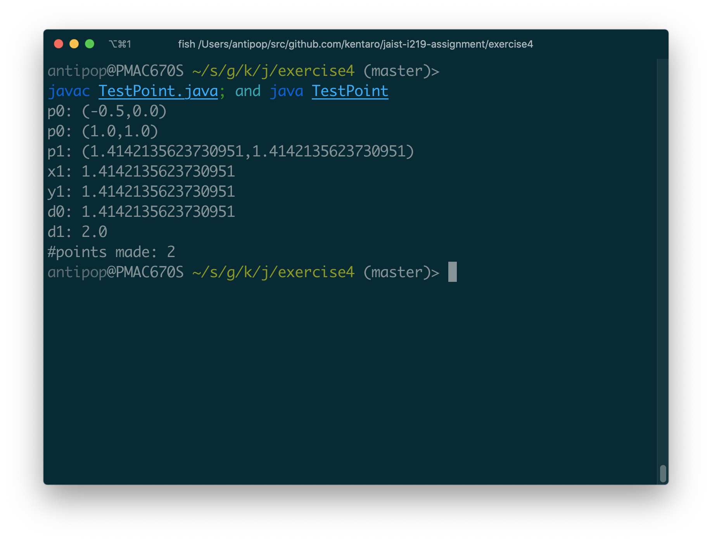
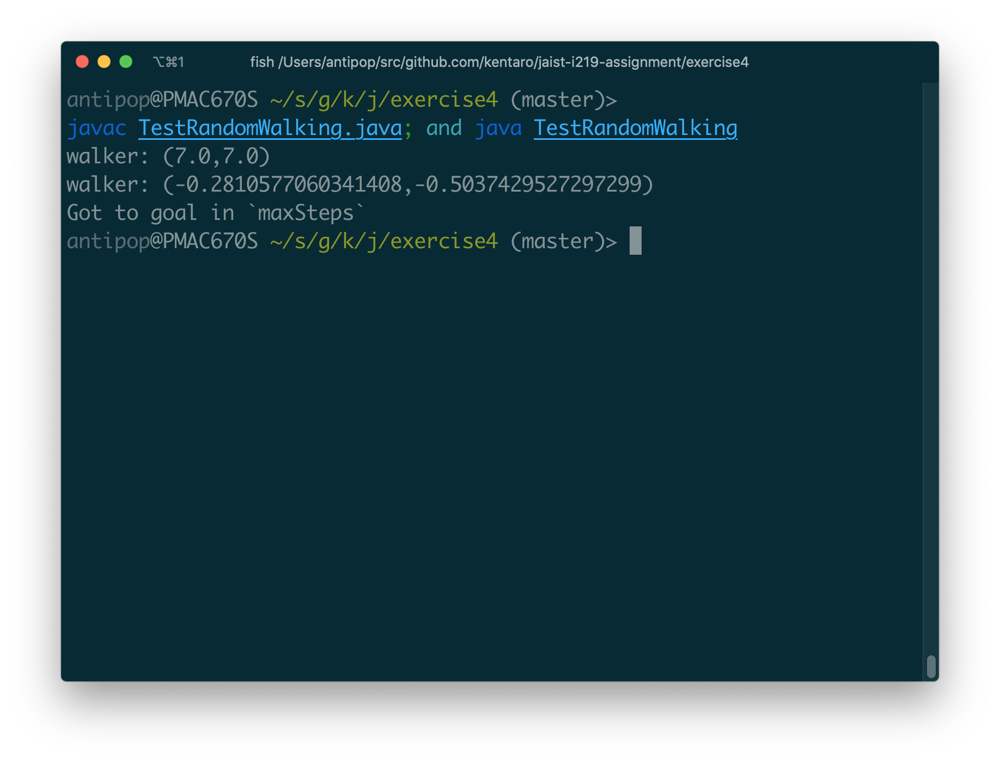
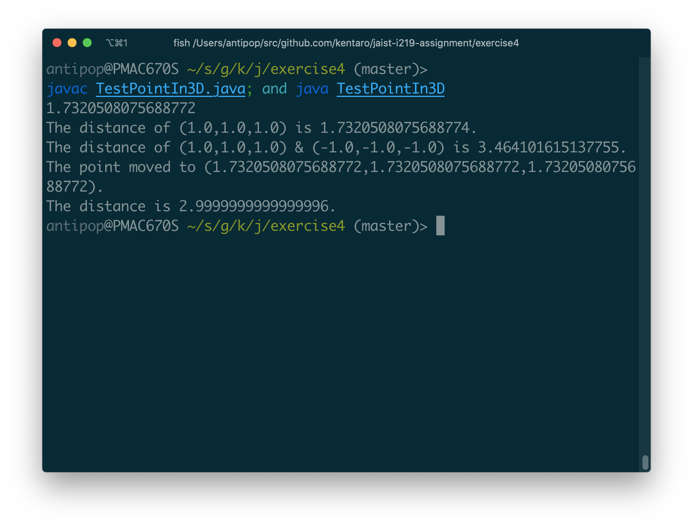
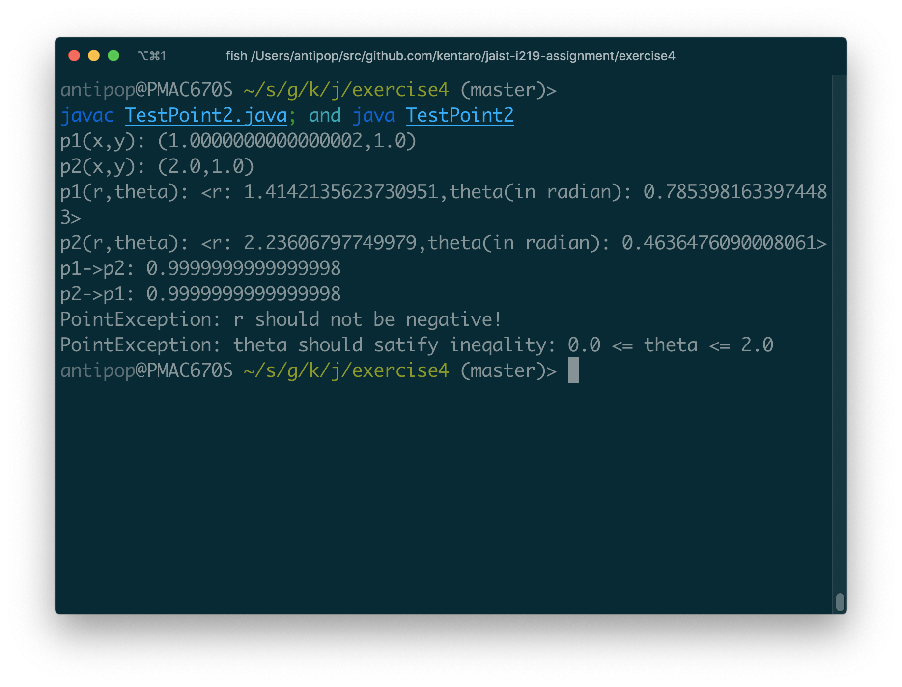
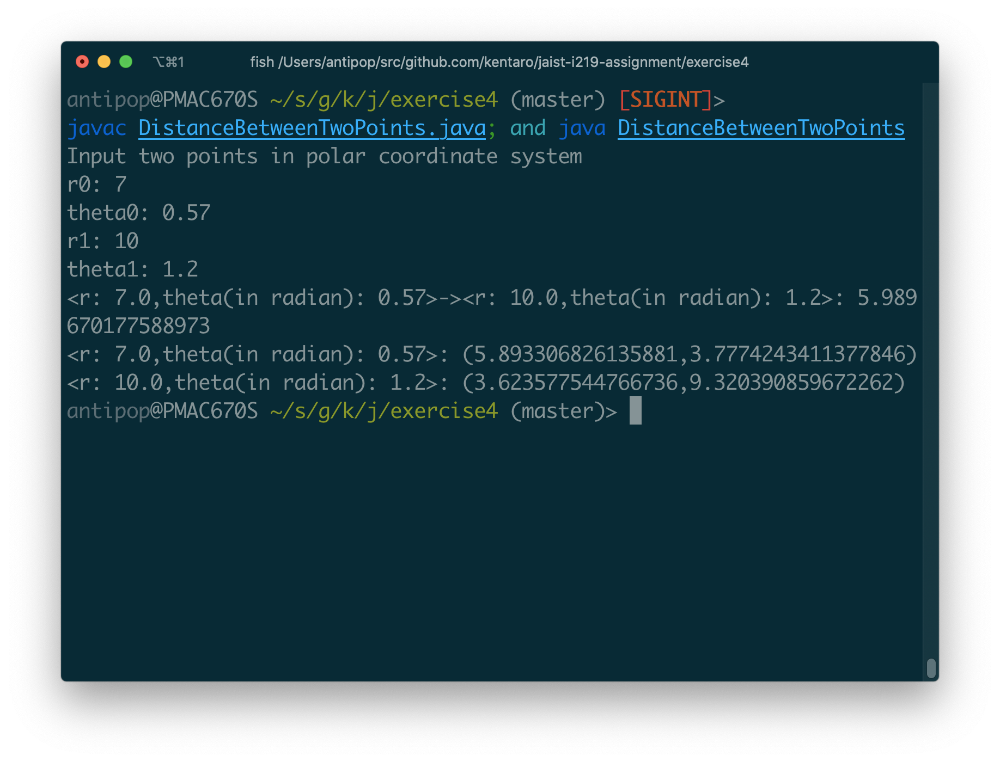

# Exercise 4

* 氏名: 栗林健太郎
* 学生番号: 2030006
* 作成日: 2020年9月19日

## Class

Lecture Noteのpp.5-15で解説されているクラスについて説明する。

### 1. Point.java

クラス`Point`は、2次元平面における点の位置を表すものである。

主な操作として、原点からの距離や他の`Point`オブジェクトからの距離を取得する`distance`メソッド、指定された位置へ移動する`move`メソッドなどを持つ。また、スタティック変数`n`としてインスタンス化された回数を保持しており、`howManyPoinsts`メソッドでその数を取得できる。

その他の特徴として、コンストラクタおよび`distance`メソッドがオーバーロードされている。

### 2. RandomWalking.java

クラス`RandomWalking`は、2つの`Point`クラスを生成し、一方をゴールを表す点、他方をゴール近傍を目指して移動する点としてランダムに動かし、`maxSteps`以内の試行でゴールに到達するか否かを判定する。

### コードの実行

クラス`Point`については、以下の通りTestPoint.javaをコンパイルした上で実行して動作を確認した。

クラス`RandomWalking`については、以下の通りTestRandomWalking.javaをコンパイルした上で実行して動作を確認した。

## Inheritance

Lecture Noteのpp.16-20で解説されている継承について説明する。

### 3. PointIn3D.java

クラス`PointIn3D`は、`Point`を継承し、3次元空間における点の位置を表すべく拡張するしたものである。

3次元空間上の点を表現するために`z`を導入した他、`distance`メソッドをオーバーライドした上で、2次元平面の距離を3次元空間上の距離とするべく計算内容を拡張している。その際、親クラスの処理を用いつつ拡張をするために`super`の呼び出しを用いている点が注目すべきポイントである。

### コードの実行

クラス`PointIn3D`については、以下の通りTestPointIn3D.javaをコンパイルした上で実行して動作を確認した。

## Interface, Exception, Exception Handling, Type Cast

Lecture Noteのpp.21-28で解説されているインタフェイス、例外、例外ハンドリング、型変換について説明する（実行するコードが資料上の章立てと一致しないので、まとめて記述する）。

### 4. PointIntereface.java

p.21からは、先に導入した地点の表現を極座標系と直交座標系でもって表現する例が、これから説明するインタフェイス、抽象クラスなどを用いて説明される。

このインタフェイス`PointInterface`は、それらの階層関係のルートにあたるものであり、`getX()`、`getY()`の実装を要求する。

### 5. AbstractPoint.java

抽象クラス`AbstractPoint`は、`PointInterface`を実装する。また、3つの抽象メソッドを定義するとともに、`distance`メソッドをオーバーロードしている。

### 6. AbstractPointPolarCoordinates.java

抽象クラス`AbstractPointPolarCoordinates`は、`AbstractPoint`を継承し、`r`および`theta`で表される極座標系における点を表すクラスの基本的な操作を定義している。

また、`convertToRectangularCoordinates`として、自身の点を直交座標系へ変換する処理を定義しているのも注目すべきポイントである。

### 7. PointPolarCoordinatesRadian.java

クラス`PointPolarCoordinatesRadian`は、極座標系における点を表す前述の抽象クラス`AbstractPointPolarCoordinates`を継承し、`theta`がラジアンで表される場合に対応するものである。

このクラスのインスタンス生成時には、引数`r`および`theta`を検証し、不正な値が渡された場合には例外`PointException`が投げられる。

また、`r`および`theta`で表される点を、直交座標系におけるX軸上、Y軸上の座標へ変換するため、`getX()`および`getY()`が定義されている。親クラスで定義されている`convertToRectangularCoordinates`は、これらを用いて極座標系を直交座標系へと変換する処理を実現しているのも注目すべきポイントである。

### 8. PointException.java

例外`PointException`は、上述のクラス`PointPolarCoordinatesRadian`および、本レポートでは説明しないクラス`PointPolarCoordinatesDegree`のインスタンス生成時にわたされた引数が不正なときに投げられる例外を表すものである。

### 9. DistanceBetweenTwoPoints

クラス`DistanceBetweenTwoPoints`は、エントリポイントmain関数を含む実行プログラムである。

`r`および`theta`をコマンドライン入力として2回受け取り、その二組みの値からそれぞれに対応する`PointPolarCoordinatesRadian`オブジェクトを生成する。このとき、`r`および`theta`として不正な値がわたされた場合には例外`PointException`が、数字として不正な値が渡された場合には例外`NumberFormatException`が発生するが、try-catch文によりプログラムが不正終了しないよう例外ハンドリングを行っている。

その後、`AbstractPoint[]`型の変数として`q`が宣言され、その`q`に格納する値を取得するために、`AbstractPoint[]`型の変数`p`の要素に対して`convertToRectangularCoordinates`メソッドを実行しようとしている。しかし、`p[j]`は`AbstractPoint`型であるため、そのメソッドを呼べるようにするために子クラスの`AbstractPointPolarCoordinates`に型変換をしているのも注目すべきポイントである。

### コードの実行

上述したクラス等については、以下の通りTestPoint2.javaをコンパイルした上で実行して動作を確認した。

クラス`DistanceBetweenTwoPoints`については、以下の通りDistanceBetweenTwoPoints.javaをコンパイルした上で実行して動作を確認した。

