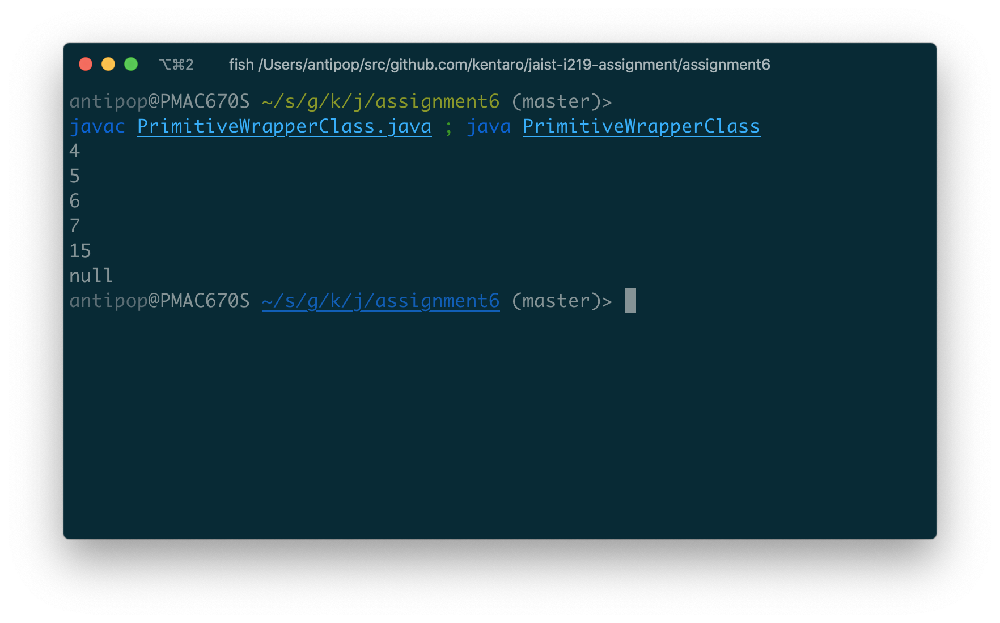
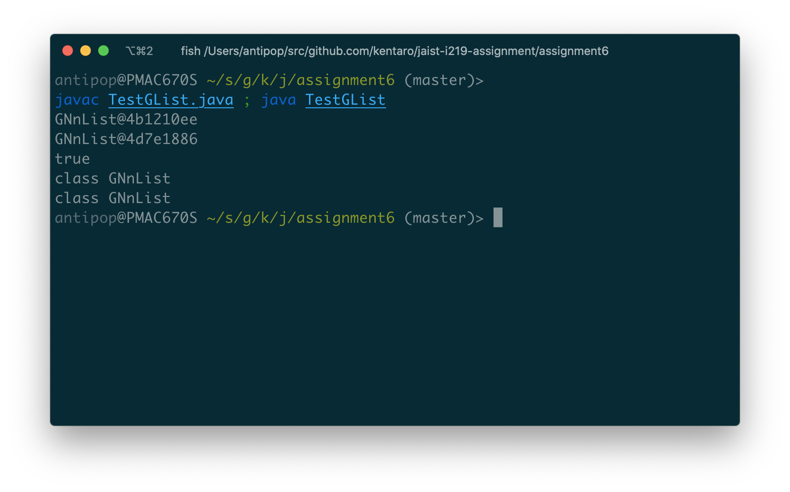
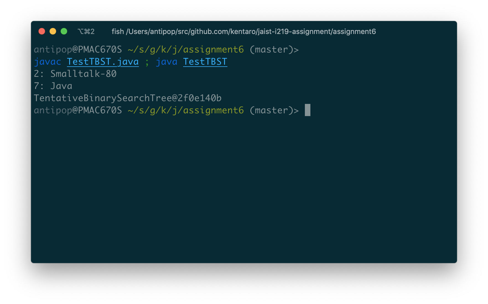
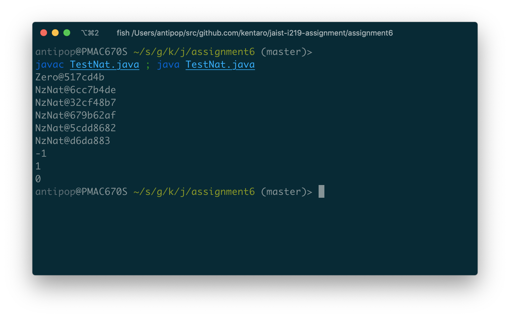
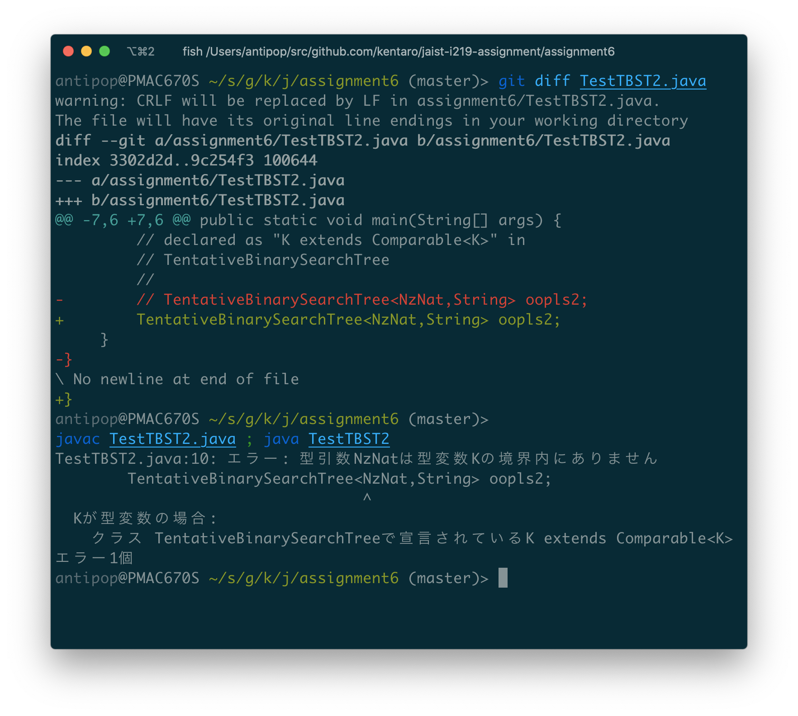

# Assignment 6

* 氏名: 栗林健太郎
* 学生番号: 2030006
* 作成日: 2020年10月26日

## プリミティブ型のラッパークラス

### `PrimitiveWrapperClass`

Javaのジェネリクスは型引数としてプリミティブ型をサポートしないため、プリミティブ型のそれぞれに対応するラッパークラスを使う必要がある。`PrimitiveWrapperClass`では、`int`型と`Integer`型とが相互に操作可能であることを確認している。

ただし、一点相違点がある。それは、プリミティブ型で宣言された変数は`null`をセットできないが、ラッパークラスではそうではないということである。

### コードの実行

以下の通りPrimitiveWrapperClass.javaをコンパイルした上で実行して動作を確認した。



なお、Java9からは`new Integer(int)`および`new Integer(String)`は非推奨になっており、`Integer.valueOf(int|String)`を用いることが推奨されている（参照: [Deprecated List (Java SE 9 & JDK 9 )](https://docs.oracle.com/javase/9/docs/api/deprecated-list.html)）。そのため、このコードをJava9以上のバージョンでコンパイルすると警告が表示される。

## 汎用的なリスト型

### GList.java

ジェネリック型`GList`として、型パラメタ`E`で表されるオブジェクトを要素に持つ汎用的なリスト型を表すインタフェイスを定義している。

引数として渡された要素をリストの先頭に配置する`cons`メソッドと、引数として渡された`GList`型のリストを、レシーバのあとに追加する`append`メソッドの実装を要求する。

### GNil.java

空リストを表すジェネリック型`GNil`として、インタフェイス`GList`を実装して定義している。

`cons`は、引数として渡された要素を自分自身の先頭に置いた新たな`GNnList`を生成して返す。`append`は、引数として渡されたリストをそのまま返す。

### GNnList.java

空ではないリストを表すジェネリック型`GNnList`として、インタフェイス`GList`を実装して定義している。

リストの先頭を表す`head`フィールド、および、リストの残りの要素を表す`tail`フィールドを持つ。

`cons`は、引数として渡された要素を自分自身の先頭に置いた新たな`GNnList`を生成して返す。`append`は、引数として渡されたリストを`tail`の後ろに追加した上で、`head`を先頭に置いた新たな`GNnList`を生成して返す。

### コードの実行

以下の通りTestGList.javaをコンパイルした上で実行して動作を確認した。



## 汎用的な二分探索木

### TBSTree.java

ジェネリック型`TBSTree`として、以下の2つの型パラメタで表されるオブジェクトをkey/valueとして持つ、汎用的な二分探索木を表すインタフェイスを定義している。

* `K extends Comparable<K>`: keyは、比較可能なオブジェクトを表す`Comparable<K>`を実装したオブジェクト
* `V`: valueは、任意の非プリミティブ型のオブジェクト

引数として渡されたkey/valueをツリーに追加する`put`メソッドと、引数として渡されたkeyに対応するvalueを返す`get`メソッドの実装を要求する。

### TBSLeaf.java

ジェネリック型`TBSLeaf`として、インタフェイス`TBSTree`を実装して二分探索木のリーフを表すクラスを定義している。

`put`は、引数として渡されたkey/valueを持つノードを生成し、その左右の枝に自分自身を置く。

`get`は、`null`を返す（リーフはkey/valueを保持しないため）。

### TBSNlTree.java

ジェネリック型`TBSNlLeaf`として、インタフェイス`TBSTree`を実装して二分探索木のノードを表すクラスを定義している。

ノードはkey/valueを値として保持するため、keyを表す`key`フィールド、および、valueを表す`val`フィールドを持つ。また、ノードの左の枝を表す`left`フィールド、および、右の枝を表す`right`フィールドを持つ。

`put`は、引数として渡されたkey/valueについて、`this`のkeyとの値の大小を比較し、小さければ左の枝へ、大きければ右の枝へノードを追加し、同じなら自分自身の`val`を書き換える。

`get`は、引数として渡されたkeyについて、`this`のkeyとの値の大小を比較し、小さければ左のvalueを、大きければ右のvalueを、同じなら自分自身の`val`を返す。

### TentativeBinarySearchTree.java

上記の二分探索木を利用するためのユーティリティクラスである。

### コードの実行

以下の通りTestTBST.javaをコンパイルした上で実行して動作を確認した。



## ペアノの自然数

### Nat.java

ジェネリック型`Nat`として、ペアノの自然数を表すインタフェイスを定義している

引数として渡された`Nat`を自分自身と足し合わせる`plus`メソッドの実装を要求する。また、`Comparable`インタフェイスを拡張しているため、`compareTo`メソッドの実装も要求する。

### Zero.java

ジェネリック型`Zero`として、ゼロを表すクラスを定義している。

`plus`は、引数として渡された`Nat`オブジェクト自体を返す（ゼロに何をたしても足した数そのものになるため）。

`compareTo`は、引数として渡された`Nat`オブジェクトがゼロならば同値であるので`0`を、そうでないならば引数のほうが大きいので`-1`を返す。

### NzNat.java

ジェネリック型`NzNat`として、自然数を表すクラスを定義している。

`plus`は、引数として渡された`Nat`オブジェクトを足し合わせた数を表す`NzNat`オブジェクトを生成して返す。

`compareTo`は、引数として渡された`Nat`オブジェクトがゼロならばかならず大きくなるので`1`を、そうでないならば引数と比較した結果を返す。

### コードの実行

以下の通りTestNat.javaをコンパイルした上で実行して動作を確認した。



## 二分探索木の改良

### BSTree.java, BSNlTree.java, BSTree.java, BinarySearchTree.java

先に説明した、TBSTree.javaを始めとするクラスによる二分探索木の実装には問題がある。BSTree.java他のクラスはその問題を解消した二分探索木の実装である。

ここで言う問題とは、次の通りである。

TBSTree.java（およびその関連クラス）では型引数が以下のような定義になっているが、

```
TBSTree<K extends Comparable<K>, V>
```

この時`K`は`Comparable<K>`のサブクラスである必要がある。一方で、上記で説明したペアノの自然数を実装したクラスでは、`Nat`は以下のように定義されているため、

```
public interface Nat extends Comparable<Nat>
```

これを実装した`Zero`や`NzNat`は当該二分探索木が要求する`K extends Comparable<K>`にあてはまらないからである**（1）**。

そこで、`Comparable<K>`を`Comparable<? super K>`とすることで、`K`およびその親クラスを受け入れるようにすることで、ペアノの自然数を実装したクラス群も扱える二分探索木を実装できる**（2）**。

### コードの実行

まず、上記の**（1）**を確認する。

以下の通り、TestTBST2.java内のコメントはずした上でコンパイルを試み、コンパイルが失敗することを確認した。



その上で、上記の**（2）**を確認する。

以下の通りTestNat.javaをコンパイルした上で実行して動作を確認した。


