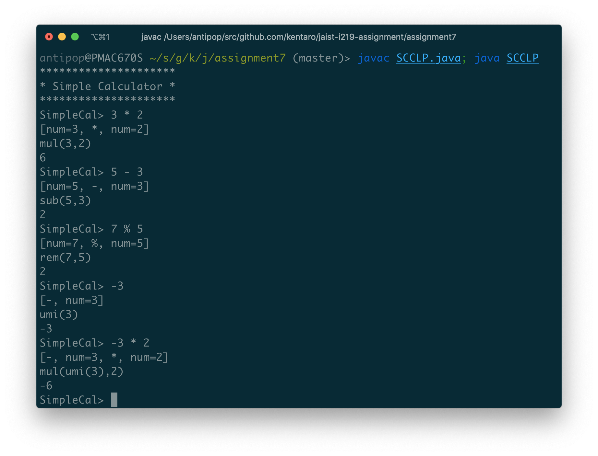

# Assignment 7

* 氏名: 栗林健太郎
* 学生番号: 2030006
* 作成日: 2020年10月28日

## Simple Calculator

### クラス図

以下、プログラムの流れに沿って、クラス図に記載されたクラスについて説明する。

### `SCCLP`

本アプリケーションSimple Calculatorのエンドポイントを提供するクラス。標準入力から1行ずつ読み込んだ文字列が:

* `help`という文字列だったら`help()`メソッドを実行し使い方を表示する
* `quit`という文字列だったらループを抜けプログラムを終了する
* その他だったら、`SimpleCalculator`クラスのインスタンスが持つ`calculate`メソッドにより処理する

### `SimpleCalculator`

入力された文字列を解析し処理する入口となるクラス。処理のために以下3つのオブジェクトに依存する。

* `sc`: 入力された文字列から`SourceCode`クラスのインスタンスを生成し保持する
* `tl`: `sc.scan()`によって解析されたトークンのリストを表す`TokenList`クラスのインスタンスを保持する
* `ept`: `tl.parse()`によってパースされた構文木を保持する

### `SourceCode`

入力された文字列を解析し、計算式を表すトークンのリストとして`TokenList`クラスのインスタンスを返すクラス。

`scan()`メソッドにより、入力された文字列を1文字ずつスキャンし、文字に対応する`TokenName`から`Token`クラスのインスタンスを生成し、`TokenList`クラスのインスタンスに追加していく。

### `TokenList`, `SyntaxErrorException`, `Token`, `TokenName`

計算式を表すトークンのリストを表し、そのリストをパースして構文木を返す。計算式として不正がある場合、シンタックスエラーを表す`SyntaxErrorException`例外を投げる。

`TokenList`クラスは`ArrayList`クラスを継承しており、その要素はトークンを表す`Token`クラスのインスタンスからなる。また、そのリストは順序付きのリストである。

`Token`クラスは、計算式を構成する文字それぞれに対応しており、その名前を表す`name`属性は`TokenName`クラスと対応している。

`TokenList`クラスのインスタンスは、`parse()`メソッドによりトークンをひとつずつ見ていく。トークンの種類に応じて対応する演算を表す構文木を表す`ExpParseTree`インタフェイスを実装したクラスを生成し、再帰的に構文木を作っていく。

### `ExpParseTree`, `NumParseTree`, `AddParseTree`, `MulParseTree`, `SubParseTree`, `QuoParseTree`,  `RemParseTree`, `UmiParseTree`

`ExpParseTree`は、構文木を表すクラスの基底となるインタフェイスであり、`calculate()`メソッドの実装を要求する。

#### 即値

`ExpParseTree`を実装する`NumParseTree`は、即値を表すクラスである。計算結果は、インスタンスが保持する数そのものになる。

#### 二項演算子

`ExpParseTree`を実装する `AddParseTree`, `MulParseTree`, `SubParseTree`, `QuoParseTree`, `RemParseTree`は、二項演算子を表すクラスである。それぞれ、加算、乗算、減算、除算、剰余をの計算を表す。

`ept1`および`ept2`属性に保持する構文木を再帰的に計算し、それぞれのクラスに対応する計算を実行する。

#### 単項演算子

`ExpParseTree`を実装する`UmiParseTree`は、単項演算子を表すクラスである。

`ept`属性の計算結果に対して、負の単項演算を行う。

### 実行結果

本アプリケーションSimple Calculatorを、以下の通り実行した。本課題において追加を要した`MulParseTree`, `SubParseTree`, `QuoParseTree`, `UmiParseTree`に関する計算式を実行している。

