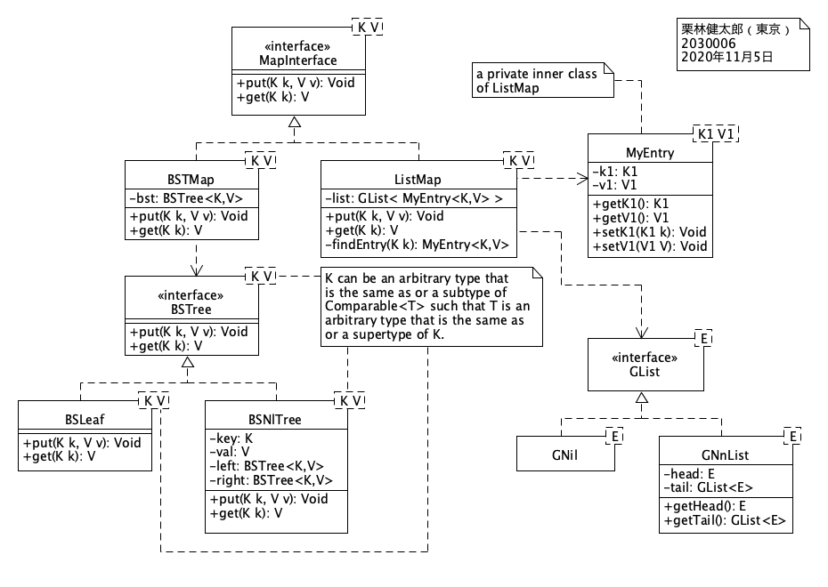
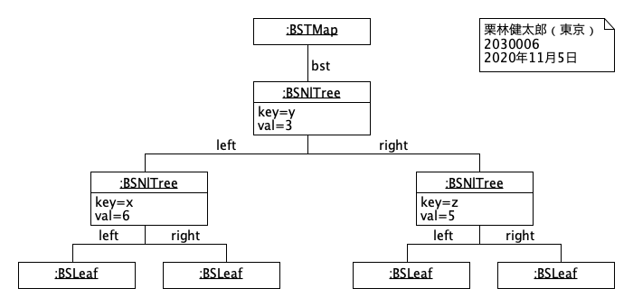
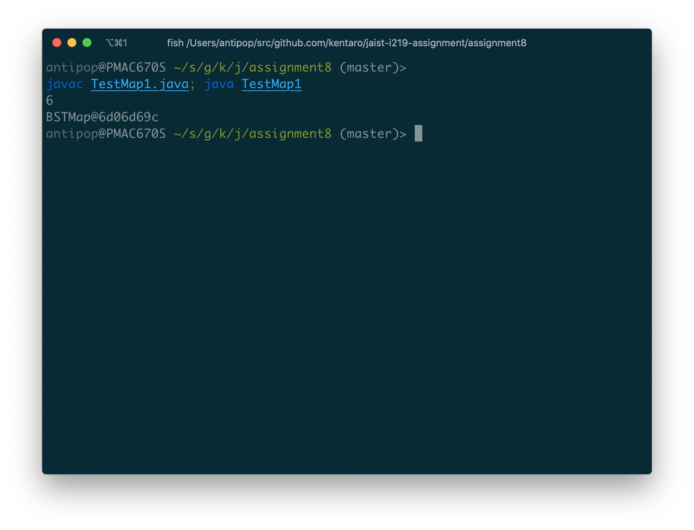
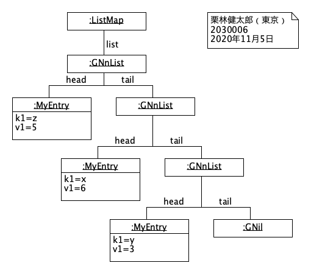

# Assignment 8

* 氏名: 栗林健太郎
* 学生番号: 2030006
* 作成日: 2020年11月5日

## `MapInterface`を実装したクラス群

本課題では、`MapInterface`インタフェイスを導入することで、異なる実装のMapを同じインタフェイスの元で設計・実装する。`BSTMap`は、二分探索木を用いたMap実装である。`ListMap`は、リストによるMap実装である。

### クラス図の全体像



先述の通り、`BSTMap`クラスと`ListMap`クラスとは、`MapInterface`インタフェイスを実装している。以下、それぞれについて述べる。

#### `BSTMap`

`BSTMap`は、二分探索木によるMap実装である。そのノードとして`BSTree`インタフェイスを実装した`BSLeaf`クラス、および、`BSNlTree`クラスのインスタンスを持つ。

##### オブジェクト図

以下のコードを実行した際のオブジェクト図を示す。

```java
MapInterface<String,Integer> map = new BSTMap<String,Integer>();
map.put("y",3);
map.put("x",4);
map.put("z",5);
map.put("x",6); // ← この時点
```



`key`を比較して、小さいものは左、大きいものは右のノードに配置されるため、ソースコード内のコメント「この時点」の時点においては、このオブジェクト図の通りの形になる。

##### 実行結果

`TestMap1.java`を実行することで、`BSTMap`の動作を以下の遠リ確認した。



#### `ListMap`

`ListMap`は、リストによるMap実装である。その要素として`GList`インタフェイスを実装した`GNil`クラス、および、`GNnList`クラスのインスタンスを持つ。

##### オブジェクト図

以下のコードを実行した際のオブジェクト図を示す。

```java
MapInterface<String,Integer> map = new ListMap<String,Integer>();
map.put("y",3);
map.put("x",4);
map.put("z",5);
map.put("x",6); // ← この時点
```



`key`に対応する`MyEntry`クラスのオブジェクトがない場合には、新たに`MyEntry`クラスのオブジェクトを作る。そして、それを`head`、元の`list`を`tail`とする`GNlList`を新たに生成し、`ListMap`クラスのオブジェクトの`list`とおきかえる。そのため、ソースコード内のコメント「この時点」の時点においては、このオブジェクト図の通りの形になる。

##### 実行結果

`TestMap2.java`を実行することで、`ListMap`の動作を以下の遠リ確認した。


