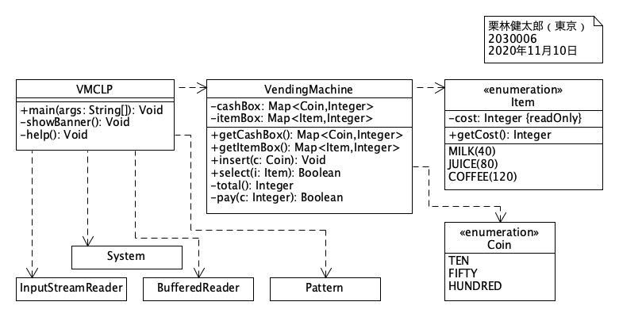

# Assignment 9

* 氏名: 栗林健太郎
* 学生番号: 2030006
* 作成日: 2020年11月14日

## Vending Machine

本課題では、自動販売機を模したコマンドラインプログラムを実装した。以下では、クラス図、状態図、シーケンス図に基づいて、プログラムについて説明する。

### クラス図

#### `VMCLP`

クラス図に示すクラス群の実行するエンドポイントを提供するクラスである。

入力を文字列として受け取り、指定されたコマンドを実行する。引数のあるコマンド（`insert`および`select`）については、正規表現を用いて、どのコインとアイテムが指定されたかを判定する。

#### `VendingMachine`

自動販売機を表すクラスである。

`Map`インタフェイスを実装した`HashMap`型の属性`cashBox`および`itemBox`によって、それぞれ硬貨と商品の状態（投入された数、購入された数）を保持している。

`insert`メソッドは、指定されたコインを1枚投入するメソッドである。

`select`メソッドは、指定された商品を購入するメソッドである。商品の値段が、`total()`メソッドで得られる投入された硬貨の合計額を計算するより大きい場合、`false`を返す。そうでない場合は、商品を購入し`itemBox`に追加して、`true`を返す。

プライベートメソッド`pay`は、`select`メソッド実行時に支払い処理を担当するメソッドである。50円と100円とを10円に充当することを繰り返すことで、引数として渡された商品の金額に対する引当てを行い、支払い処理をする。

#### `Item`

自動販売機の商品を表すクラスである。列挙型を用いて商品の種別と値段を表現している。コンストラクタと`getCost`メソッドを定義することで、商品の値段を設定、取得できるようにしているところがポイントである。

#### `Coin`

硬貨を表すクラスである。列挙型を用いて硬貨の種別を表現している。

### 状態図

この状態図は、自動販売機プログラムの内部状態をユースケースに沿って示すものである。

`help`は、本プログラムの使い方を表示する。`showItems`は、購入した商品の種類と数を表示する。`showCoins`は、投入した硬貨の種類と数を表示する。

`insert(coin)`は、硬貨の種類（10, 50, 100）を引数に取り、それぞれに応じて投入したコインの内部状態を更新する。対応していないコインの場合、エラーメッセージを表示する。

`select(item)`は、商品の種類（milk, juice, coffee）を引数に取り、それぞれに応じて投入した購入商品の内部状態を更新する。対応していない商品の場合、エラーメッセージを表示する。

### シーケンス図

このシーケンス図は、硬貨を投入する処理の流れを示すものである。まず、指定されたコインの現在の投入数を調べ、その数に1を追加する。

このシーケンス図は、商品を購入する処理の流れを示すものである。選択した商品の値段と、既に投入した合計金額とを比較する。もし金額が足りなければ、エラーメッセージを表示する。金額が足りていれば支払い処理を行う。支払い処理が成功したら`true`を、そうでなければ`false`を返す。

このシーケンス図は、支払い処理の流れを示すものである。商品の値段に対して投入した10円の数が足りなければ、50円あるいは100円を見ていく。50円があれば、50円を10円の枚数に引き当てていく。100円があれば、100円を50円と10円の枚数に引き当てていく。それを繰り返して、10円の枚数で支払いを完了する。

##### 実行結果

`VMCLP.java`を実行することで以下の通り動作を確認した。

`help`に表示されているコマンドをそれぞれ実行し、硬貨と商品の内部状態が意図したとおりに変化していくことを確認している。
